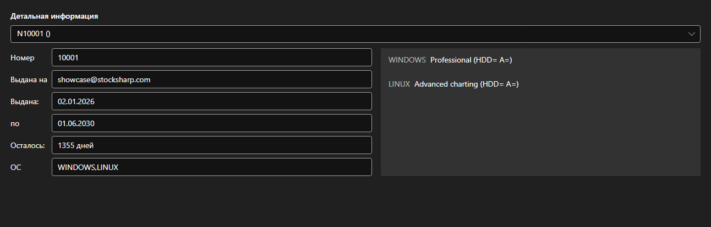

# Лицензии



[LicensePanel](xref:StockSharp.Xaml.LicensePanel) - панель установленных лицензий. Лицензия выбирается в списке сверху; ниже показаны её номер, кому она выдана, даты выдачи и окончания, сколько дней осталось и поддерживаемые операционные системы, а справа \- разрешённые ей возможности.

**Основные свойства**

- [LicensePanel.Licenses](xref:StockSharp.Xaml.LicensePanel.Licenses) - список лицензий.

Панель встраивается в окно «О программе» и в мастер первого запуска: по ней сразу видно, какая лицензия истекает и каких возможностей не хватает.

Ниже показаны фрагменты кода с его использованием:

```xaml
<Window x:Class="Sample.LicenseWindow"
	xmlns="http://schemas.microsoft.com/winfx/2006/xaml/presentation"
	xmlns:x="http://schemas.microsoft.com/winfx/2006/xaml"
	xmlns:xaml="http://schemas.stocksharp.com/xaml"
	Height="400" Width="800">
	<xaml:LicensePanel x:Name="LicensePanel" />
</Window>
```

```cs
// Показываем установленные лицензии
LicensePanel.Licenses = LicenseHelper.Licenses;
```

## См. также

[Служебные панели](../service_panels.md)
