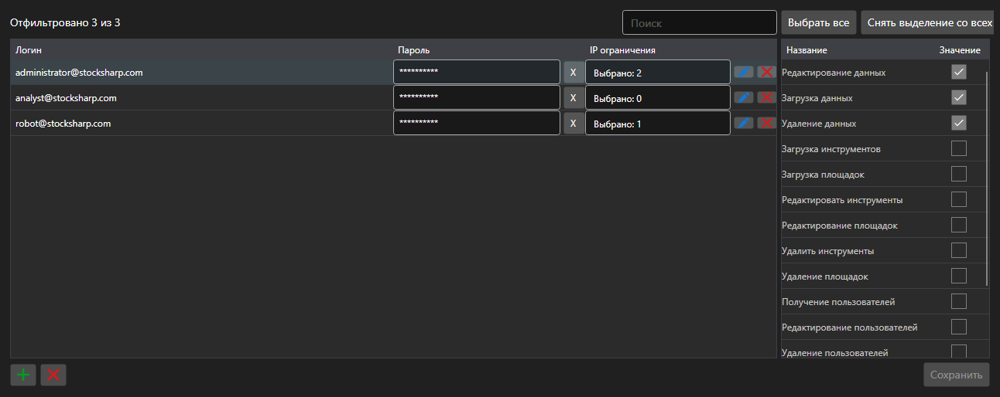

# Учётные записи и права



[PermissionCredentialsPanel](xref:StockSharp.Xaml.PermissionCredentialsPanel) - таблица учётных записей сервера с правами доступа. Для каждой записи отмечается, какие операции разрешены: загрузка данных, редактирование, выставление заявок, управление сервером.

**Основные свойства**

- [PermissionCredentialsPanel.Credentials](xref:StockSharp.Xaml.PermissionCredentialsPanel.Credentials) - список учётных записей.
- [PermissionCredentialsPanel.ChangedCredentials](xref:StockSharp.Xaml.PermissionCredentialsPanel.ChangedCredentials) - записи, изменённые с момента последнего сохранения.
- [PermissionCredentialsPanel.SaveText](xref:StockSharp.Xaml.PermissionCredentialsPanel.SaveText) - надпись на кнопке сохранения.

Записи панель не сохраняет \- по кнопке она поднимает событие `Saving`, приложение записывает изменённые учётные записи и вызывает [PermissionCredentialsPanel.MarkSaved](xref:StockSharp.Xaml.PermissionCredentialsPanel.MarkSaved), после чего список изменённых очищается.

Ниже показаны фрагменты кода с его использованием:

```xaml
<Window x:Class="Sample.CredentialsWindow"
	xmlns="http://schemas.microsoft.com/winfx/2006/xaml/presentation"
	xmlns:x="http://schemas.microsoft.com/winfx/2006/xaml"
	xmlns:xaml="http://schemas.stocksharp.com/xaml"
	Height="500" Width="900">
	<xaml:PermissionCredentialsPanel x:Name="CredentialsPanel" />
</Window>
```

```cs
// Показываем учетные записи сервера
CredentialsPanel.Credentials.AddRange(_server.Credentials);

// Сохраняем только изменившиеся записи
CredentialsPanel.Saving += () =>
{
	foreach (var credentials in CredentialsPanel.ChangedCredentials)
		_server.Save(credentials);

	// Сбрасываем список изменений
	CredentialsPanel.MarkSaved();
};
```

## См. также

[Служебные панели](../service_panels.md)
