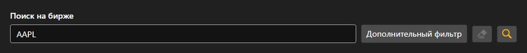

# Поиск инструментов



[SecurityLookupPanel](xref:StockSharp.Xaml.SecurityLookupPanel) - панель поиска инструментов. В строке вводится код или его часть, а за кнопкой дополнительного фильтра открывается редактор [Security](xref:StockSharp.BusinessEntities.Security), где задаются тип, площадка, валюта и дата экспирации.

Панель ничего не ищет сама \- по кнопке поиска или по клавише ввода она поднимает событие `Lookup` с заполненным фильтром. Что делать дальше \- отправлять запрос коннектору или искать в локальном хранилище \- решает приложение.

Ниже показаны фрагменты кода с его использованием:

```xaml
<Window x:Class="Sample.LookupWindow"
	xmlns="http://schemas.microsoft.com/winfx/2006/xaml/presentation"
	xmlns:x="http://schemas.microsoft.com/winfx/2006/xaml"
	xmlns:xaml="http://schemas.stocksharp.com/xaml"
	Height="500" Width="400">
	<xaml:SecurityLookupPanel x:Name="LookupPanel" />
</Window>
```

```cs
// Отправляем поисковый запрос коннектору
LookupPanel.Lookup += filter =>
{
	// Фильтр приходит заполненным
	_connector.Subscribe(new Subscription(filter.ToLookupMessage()));
};

// Найденные инструменты выводим в таблицу
_connector.SecurityReceived += (subscription, security) =>
	this.GuiAsync(() => SecurityGrid.Securities.Add(security));
```

## См. также

[Служебные панели](../service_panels.md)
