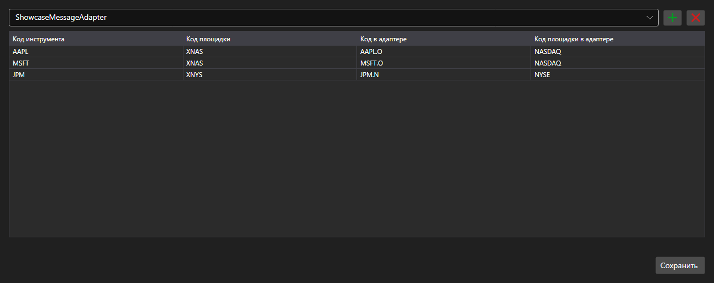

# Сопоставление кодов инструментов



[SecurityMappingPanel](xref:StockSharp.Xaml.SecurityMappingPanel) - таблица соответствий между кодом инструмента в системе и его кодом у конкретного коннектора. Решает обычную проблему: один и тот же контракт называется по\-разному у разных поставщиков данных.

**Основные свойства**

- [SecurityMappingPanel.ConnectorsInfo](xref:StockSharp.Xaml.SecurityMappingPanel.ConnectorsInfo) - список коннекторов, для которых задаются соответствия.
- [SecurityMappingPanel.Storage](xref:StockSharp.Xaml.SecurityMappingPanel.Storage) - хранилище соответствий.
- [SecurityMappingPanel.SaveText](xref:StockSharp.Xaml.SecurityMappingPanel.SaveText) - надпись на кнопке сохранения.

Строки добавляются и удаляются прямо в таблице, а по нажатию кнопки сохранения возникает событие `Saving` \- приложение записывает изменения в хранилище и меняет надпись на кнопке.

Ниже показаны фрагменты кода с его использованием:

```xaml
<Window x:Class="Sample.MappingWindow"
	xmlns="http://schemas.microsoft.com/winfx/2006/xaml/presentation"
	xmlns:x="http://schemas.microsoft.com/winfx/2006/xaml"
	xmlns:xaml="http://schemas.stocksharp.com/xaml"
	Height="500" Width="900">
	<xaml:SecurityMappingPanel x:Name="MappingPanel" />
</Window>
```

```cs
// Задаем хранилище соответствий
MappingPanel.Storage = _securityMappingStorage;

// Добавляем коннектор в список
MappingPanel.ConnectorsInfo.Add(new ConnectorInfo("Binance"));

// Подтверждаем сохранение надписью на кнопке
MappingPanel.Saving += () => MappingPanel.SaveText = LocalizedStrings.Saved;
```

## См. также

[Служебные панели](../service_panels.md)
