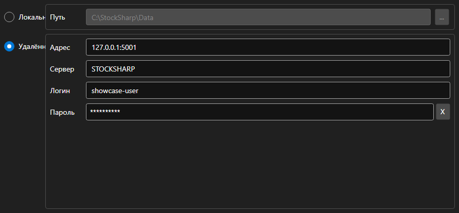

# Настройки хранилища



[StorageSettingsPanel](xref:StockSharp.Xaml.StorageSettingsPanel) - панель выбора хранилища рыночных данных. Переключает между локальной папкой и удалённым сервером и задаёт параметры выбранного варианта.

**Основные свойства**

- [StorageSettingsPanel.IsLocal](xref:StockSharp.Xaml.StorageSettingsPanel.IsLocal) - использовать локальное хранилище.
- [StorageSettingsPanel.Path](xref:StockSharp.Xaml.StorageSettingsPanel.Path) - путь к папке локального хранилища.
- [StorageSettingsPanel.Address](xref:StockSharp.Xaml.StorageSettingsPanel.Address) - адрес удалённого сервера.
- [StorageSettingsPanel.Login](xref:StockSharp.Xaml.StorageSettingsPanel.Login) - имя пользователя для удалённого сервера.
- [StorageSettingsPanel.IsCredentialsEnabled](xref:StockSharp.Xaml.StorageSettingsPanel.IsCredentialsEnabled) - доступность полей логина и пароля.

Любое изменение вызывает событие `SettingsChanged`, по которому приложение пересоздаёт [IMarketDataDrive](xref:StockSharp.Algo.Storages.IMarketDataDrive).

Ниже показаны фрагменты кода с его использованием:

```xaml
<Window x:Class="Sample.StorageWindow"
	xmlns="http://schemas.microsoft.com/winfx/2006/xaml/presentation"
	xmlns:x="http://schemas.microsoft.com/winfx/2006/xaml"
	xmlns:xaml="http://schemas.stocksharp.com/xaml"
	Height="300" Width="500">
	<xaml:StorageSettingsPanel x:Name="StoragePanel" />
</Window>
```

```cs
// Выбираем локальную папку
StoragePanel.IsLocal = true;
StoragePanel.Path = @"C:\Data";

// Отмечаем изменение настроек
StoragePanel.SettingsChanged += () => _isModified = true;

// Создаем хранилище по настройкам панели
var drive = StoragePanel.IsLocal
	? new LocalMarketDataDrive(StoragePanel.Path)
	: (IMarketDataDrive)new RemoteMarketDataDrive(StoragePanel.Address.To<EndPoint>());
```

## См. также

[Служебные панели](../service_panels.md)
