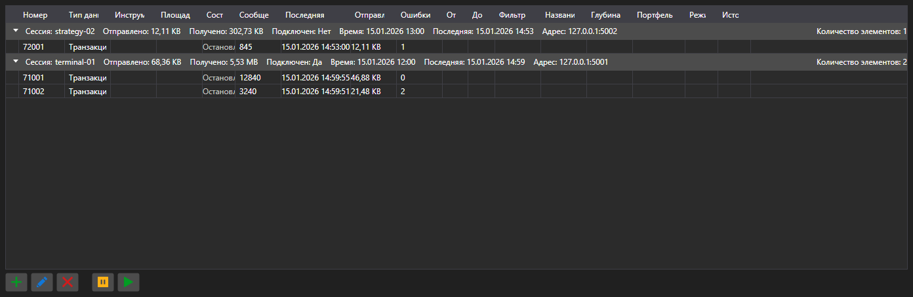

# Подписки



[SubscriptionPanel](xref:StockSharp.Xaml.SubscriptionPanel) - таблица активных подписок, сгруппированная по сессиям. Для каждой подписки показывает тип данных, число сообщений, время последнего сообщения, количество ошибок и объём переданных данных.

**Основные свойства**

- [SubscriptionPanel.Subscriptions](xref:StockSharp.Xaml.SubscriptionPanel.Subscriptions) - список подписок.
- [SubscriptionPanel.Sessions](xref:StockSharp.Xaml.SubscriptionPanel.Sessions) - список сессий.
- [SubscriptionPanel.SelectedSubscriptions](xref:StockSharp.Xaml.SubscriptionPanel.SelectedSubscriptions) - выбранные подписки.

Панель используется на стороне сервера: по ней видно, кто подключён, что запрашивает и сколько данных получает. Действия над строками \- добавление, изменение, удаление, приостановка \- поднимают одноимённые события, а выполняет их приложение.

Ниже показаны фрагменты кода с его использованием:

```xaml
<Window x:Class="Sample.SubscriptionsWindow"
	xmlns="http://schemas.microsoft.com/winfx/2006/xaml/presentation"
	xmlns:x="http://schemas.microsoft.com/winfx/2006/xaml"
	xmlns:xaml="http://schemas.stocksharp.com/xaml"
	Height="400" Width="1000">
	<xaml:SubscriptionPanel x:Name="SubscriptionPanel" />
</Window>
```

```cs
// Регистрируем сессию клиента
SubscriptionPanel.AddSession(sessionId, new SessionInfo(sessionId, DateTime.UtcNow, address));

// Добавляем подписку в таблицу
SubscriptionPanel.Subscriptions.Add(new SubscriptionInfo(session, subscription));

// Отписываемся по команде из таблицы
SubscriptionPanel.SubscriptionRemoving += info => _connector.UnSubscribe(info.Subscription);
```

## См. также

[Служебные панели](../service_panels.md)
