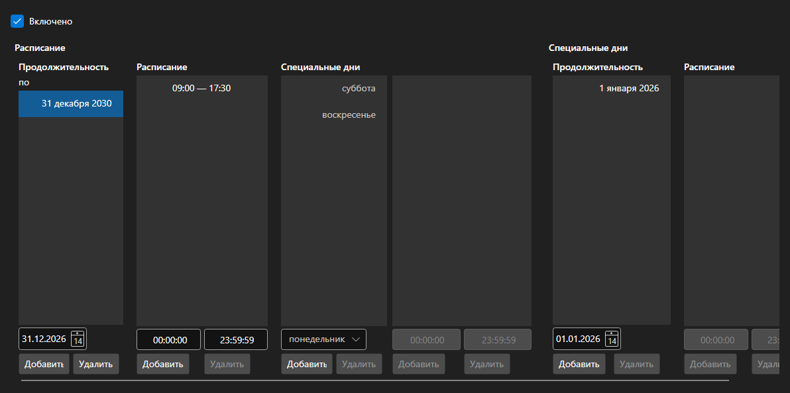

# Расписание работы



[WorkingTimeControl](xref:StockSharp.Xaml.WorkingTimeControl) - редактор расписания [WorkingTime](xref:StockSharp.Messages.WorkingTime). Задаёт периоды действия расписания, часы работы по дням недели и особые дни \- праздники и переносы.

**Основные свойства**

- [WorkingTimeControl.WorkingTime](xref:StockSharp.Xaml.WorkingTimeControl.WorkingTime) - редактируемое расписание.
- [WorkingTimeControl.ShowActive](xref:StockSharp.Xaml.WorkingTimeControl.ShowActive) - показ признака действующего периода.

Расписание состоит из периодов: у каждого свой набор рабочих часов по дням недели. Часы правятся списком интервалов, а ошибки \- пересечение интервалов, конец раньше начала \- сообщаются событием `Error`.

Ниже показаны фрагменты кода с его использованием:

```xaml
<Window x:Class="Sample.WorkingTimeWindow"
	xmlns="http://schemas.microsoft.com/winfx/2006/xaml/presentation"
	xmlns:x="http://schemas.microsoft.com/winfx/2006/xaml"
	xmlns:xaml="http://schemas.stocksharp.com/xaml"
	Height="500" Width="700">
	<xaml:WorkingTimeControl x:Name="WorkingTimeControl" />
</Window>
```

```cs
// Показываем расписание площадки
WorkingTimeControl.WorkingTime = ExchangeBoard.MicexTqbr.WorkingTime;

// Выводим ошибку рядом с редактором
WorkingTimeControl.Error += (message, isError) => ShowStatus(message, isError);

// Отмечаем изменение расписания
WorkingTimeControl.DataChanged += () => _isModified = true;
```

## См. также

[Служебные панели](../service_panels.md)
