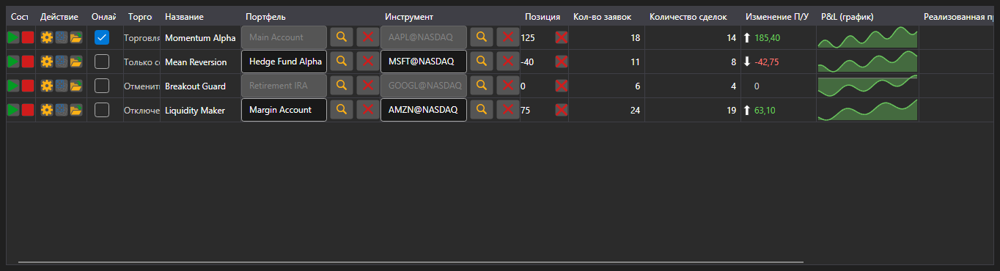

# Монитор стратегий



[StrategiesDashboard](xref:StockSharp.Xaml.StrategiesDashboard) - таблица одновременно работающих стратегий. В одной строке показывает инструмент, портфель, состояние, позицию, прибыль, число заявок и сделок, а также кнопки управления.

**Основные свойства**

- [StrategiesDashboard.Items](xref:StockSharp.Xaml.StrategiesDashboard.Items) - список строк монитора.
- [StrategiesDashboard.SecurityProvider](xref:StockSharp.Xaml.StrategiesDashboard.SecurityProvider) - поставщик инструментов для колонки инструмента.
- [StrategiesDashboard.Portfolios](xref:StockSharp.Xaml.StrategiesDashboard.Portfolios) - источник портфелей для колонки портфеля.

Строка монитора \- это [IStrategiesDashboardItem](xref:StockSharp.Xaml.IStrategiesDashboardItem), а не сама стратегия: кнопки запуска, остановки, закрытия позиции, настроек и правил риска работают через команды этого интерфейса. Поэтому монитор одинаково подходит и для локальных стратегий, и для работающих на сервере.

Ниже показаны фрагменты кода с его использованием:

```xaml
<Window x:Class="Sample.DashboardWindow"
	xmlns="http://schemas.microsoft.com/winfx/2006/xaml/presentation"
	xmlns:x="http://schemas.microsoft.com/winfx/2006/xaml"
	xmlns:xaml="http://schemas.stocksharp.com/xaml"
	Height="400" Width="1100">
	<xaml:StrategiesDashboard x:Name="Dashboard" />
</Window>
```

```cs
// Задаем источники для колонок инструмента и портфеля
Dashboard.SecurityProvider = _connector;
Dashboard.Portfolios = new PortfolioDataSource(_connector);

// Добавляем строки монитора по своим стратегиям
foreach (var strategy in _strategies)
	Dashboard.Items.Add(new StrategyDashboardItem(strategy));

// Убираем остановленную стратегию из монитора
Dashboard.Items.Remove(Dashboard.Items.First(i => i.ProcessState == ProcessStates.Stopped));
```

## См. также

[Стратегии](../strategies.md)
