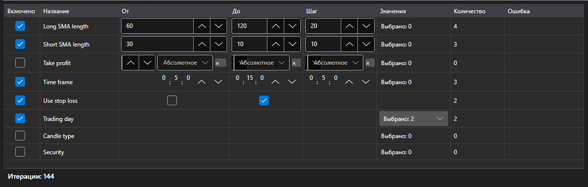

# Параметры оптимизации



[OptimizationParametersPanel](xref:StockSharp.Xaml.OptimizationParametersPanel) \- редактор параметров, по которым идёт перебор. Одна строка \- один параметр стратегии: галочка включает его в перебор, дальше идут границы и шаг либо список значений, а под таблицей \- итог: сколько прогонов даёт текущий набор.

**Основные свойства**

- [OptimizationParametersPanel.Parameters](xref:StockSharp.Xaml.OptimizationParametersPanel.Parameters) \- строки редактора. Подходит любая коллекция [IOptimizationParameterRow](xref:StockSharp.Xaml.IOptimizationParameterRow), поэтому у каждого приложения может быть своя модель параметра.
- [OptimizationParametersPanel.MaxIterations](xref:StockSharp.Xaml.OptimizationParametersPanel.MaxIterations) \- ограничение на число прогонов; ноль означает, что ограничения нет.
- [OptimizationParametersPanel.TotalCount](xref:StockSharp.Xaml.OptimizationParametersPanel.TotalCount) \- сколько прогонов даёт текущий набор: произведение числа значений всех включённых параметров, урезанное ограничением.
- [OptimizationParametersPanel.FirstProblem](xref:StockSharp.Xaml.OptimizationParametersPanel.FirstProblem) \- первая причина, по которой набор нельзя запустить.

Набор значений зависит от типа параметра: у числа и у [TimeSpan](xref:System.TimeSpan) это границы и шаг, у [bool](xref:System.Boolean) \- два значения, у перечисления, [Security](xref:StockSharp.BusinessEntities.Security) и [DataType](xref:StockSharp.Messages.DataType) \- явный список. Строка, которую нельзя пройти (шаг равен нулю, границы не заданы, список пуст), объясняет причину прямо в таблице, а итоговый счётчик такую строку не считает.

Число прогонов растёт произведением, а не суммой: три параметра по пять значений \- это 125 прогонов, а не 15. Поэтому счётчик стоит рядом с таблицей, а не на следующем шаге мастера.

Ниже показаны фрагменты кода с его использованием:

```xaml
<Window x:Class="Sample.OptimizationWindow"
	xmlns="http://schemas.microsoft.com/winfx/2006/xaml/presentation"
	xmlns:x="http://schemas.microsoft.com/winfx/2006/xaml"
	xmlns:xaml="http://schemas.stocksharp.com/xaml"
	Height="400" Width="700">
	<xaml:OptimizationParametersPanel x:Name="ParametersPanel" />
</Window>
```

```cs
// Строки редактора - модель приложения, реализующая IOptimizationParameterRow
ParametersPanel.Parameters = _rows;

// Ограничение на число прогонов
ParametersPanel.MaxIterations = 5000;

// Запускать можно, когда набор непустой и в нём нет ошибок
StartButton.IsEnabled = ParametersPanel.TotalCount > 0 && ParametersPanel.FirstProblem.Length == 0;
```

## См. также

[Стратегии](../strategies.md)

[Результаты оптимизации](optimization_results.md)
