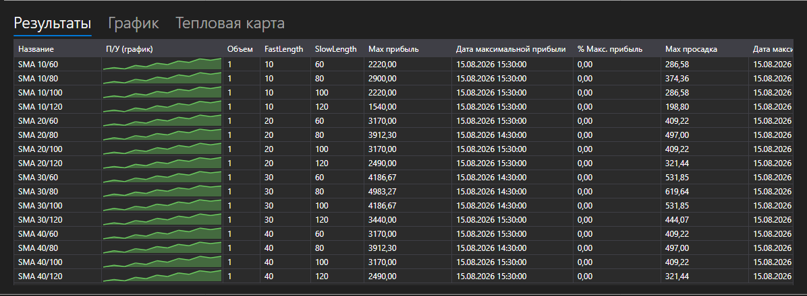

# Результаты оптимизации



[OptimizationResultsPanel](xref:StockSharp.Xaml.Charting.OptimizationResultsPanel) \- три способа прочитать результаты перебора, собранные в одном контроле:

- **Результаты** \- таблица прогонов: значения параметров, статистика и график П/У каждого прогона рядом с его числами. Это [StrategiesStatisticsPanel](xref:StockSharp.Xaml.StrategiesStatisticsPanel), поэтому колонки сортируются и настраиваются так же, как везде.
- **График** \- трёхмерная поверхность по двум параметрам: оси выбираются списками над графиком, высота \- выбранный статистический показатель.
- **Тепловая карта** \- та же поверхность сверху. Оси задаются один раз, на графике, карта их повторяет.

**Основные свойства**

- [OptimizationResultsPanel.ViewModel](xref:StockSharp.Xaml.Charting.OptimizationResultsPanel.ViewModel) \- результаты, из которых рисуются все три поверхности.

Прогоны добавляются в [OptimizationResultsViewModel](xref:StockSharp.Xaml.Charting.OptimizationResultsViewModel) в момент старта, а не по завершении: строка сразу появляется в таблице и дальше следит за своей стратегией, поэтому идущий прогон виден на всех трёх поверхностях.

- [OptimizationResultsViewModel.AddRun](xref:StockSharp.Xaml.Charting.OptimizationResultsViewModel.AddRun(StockSharp.Algo.Strategies.Strategy,System.Collections.Generic.IEnumerable{StockSharp.Algo.Strategies.IStrategyParam})) \- добавляет прогон. Первый прогон задаёт колонки таблицы и то, что предлагают оси.
- [OptimizationResultsViewModel.Refresh](xref:StockSharp.Xaml.Charting.OptimizationResultsViewModel.Refresh) \- перерисовывает поверхности, когда измеренное изменилось.
- [OptimizationResultsViewModel.Clear](xref:StockSharp.Xaml.Charting.OptimizationResultsViewModel.Clear) \- сбрасывает прогоны перед новым перебором.

Одна комбинация параметров \- одна точка поверхности. Если комбинация прогонялась несколько раз, точка показывает среднее; если комбинация не прогонялась вовсе, тепловая карта заполняет её наименьшим значением, чтобы пропуск не выглядел вершиной.

Ниже показаны фрагменты кода с его использованием:

```xaml
<Window x:Class="Sample.OptimizationResultsWindow"
	xmlns="http://schemas.microsoft.com/winfx/2006/xaml/presentation"
	xmlns:x="http://schemas.microsoft.com/winfx/2006/xaml"
	xmlns:charting="http://schemas.stocksharp.com/xaml"
	Height="600" Width="900">
	<charting:OptimizationResultsPanel x:Name="ResultsPanel" />
</Window>
```

```cs
_results = new OptimizationResultsViewModel();
ResultsPanel.ViewModel = _results;

// Оптимизатор сообщает о прогоне в момент его старта
_optimizer.StrategyInitialized += (strategy, parameters) =>
	this.GuiAsync(() => _results.AddRun(strategy, parameters));
```

## См. также

[Стратегии](../strategies.md)

[Параметры оптимизации](optimization_parameters.md)
