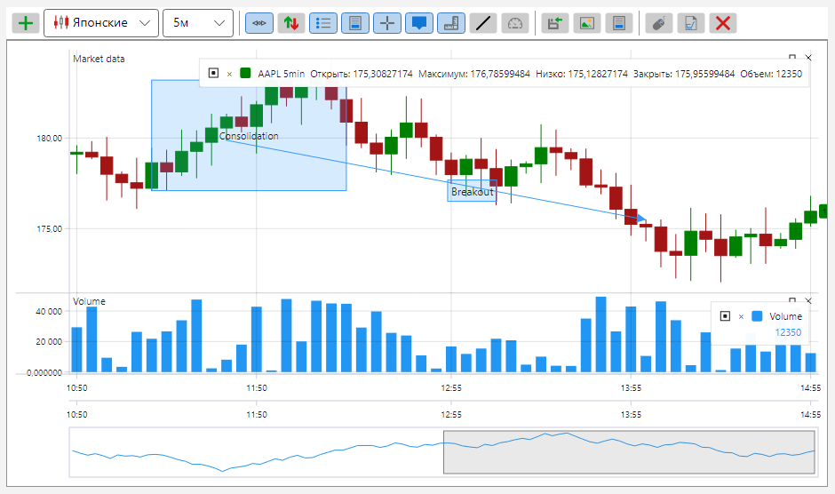
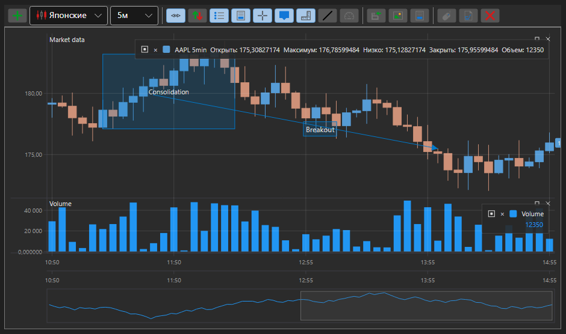

# Темы графических компонентов S\#

Для всех графических элементов S\# существует несколько разных тем. Ниже представлены две наиболее популярные темы.





Для установки темы приложения достаточно написать одну строчку. Например, для установки темной темы VisualStudio 2017 необходимо задать строчку:

```cs
...
ThemeExtensions.ApplyDefaultTheme();
...
```

Так как все графические элементы S\# базируются на графических элементах **DevExpress**, то к проекту необходимо добавить соответствующие библиотеки **DevExpress** (**DevExpress.Xpf.Core**, **DevExpress.Xpf.Themes.VS2017Dark** и т.д.)
