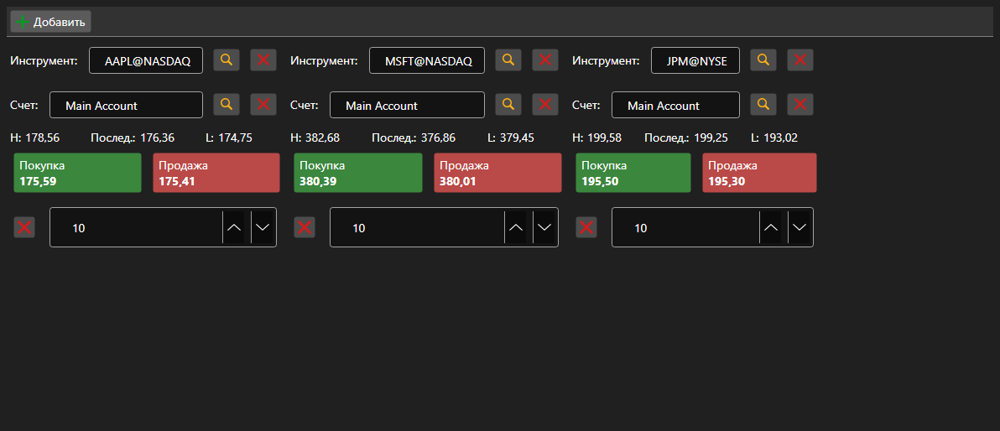

# Набор панелей Купить\/Продать



[BuySellGrid](xref:StockSharp.Xaml.BuySellGrid) - контейнер из нескольких панелей [BuySellPanel](xref:StockSharp.Xaml.BuySellPanel) \- по одной на инструмент. Даёт торговать несколькими инструментами с одного экрана.

**Основные свойства**

- [BuySellGrid.SecurityProvider](xref:StockSharp.Xaml.BuySellGrid.SecurityProvider) - поставщик инструментов для выбора в панелях.
- [BuySellGrid.Portfolios](xref:StockSharp.Xaml.BuySellGrid.Portfolios) - источник портфелей.
- [BuySellGrid.MarketDataProvider](xref:StockSharp.Xaml.BuySellGrid.MarketDataProvider) - поставщик рыночных данных, из которого панели берут лучшие цены.
- [BuySellGrid.Panels](xref:StockSharp.Xaml.BuySellGrid.Panels) - текущий набор панелей.

Панели добавляются методом [BuySellGrid.AddPanel](xref:StockSharp.Xaml.BuySellGrid.AddPanel(StockSharp.BusinessEntities.Security)) и удаляются методом [BuySellGrid.RemovePanel](xref:StockSharp.Xaml.BuySellGrid.RemovePanel(StockSharp.Xaml.BuySellPanel)). Заявки контейнер не регистрирует \- он поднимает событие `OrderRegistering` с инструментом, портфелем, направлением, ценой и объёмом. Состав панелей сохраняется и восстанавливается методами `Save` и `Load`.

Ниже показаны фрагменты кода с его использованием:

```xaml
<Window x:Class="Sample.BuySellWindow"
	xmlns="http://schemas.microsoft.com/winfx/2006/xaml/presentation"
	xmlns:x="http://schemas.microsoft.com/winfx/2006/xaml"
	xmlns:xaml="http://schemas.stocksharp.com/xaml"
	Height="400" Width="900">
	<xaml:BuySellGrid x:Name="BuySellGrid" />
</Window>
```

```cs
// Задаем источники данных для всех панелей
BuySellGrid.SecurityProvider = _connector;
BuySellGrid.MarketDataProvider = _connector;
BuySellGrid.Portfolios = new PortfolioDataSource(_connector);

// Добавляем панель по инструменту
BuySellGrid.AddPanel(_security);

// Регистрируем заявку, сформированную панелью
BuySellGrid.OrderRegistering += (security, portfolio, side, price, volume) =>
{
	_connector.RegisterOrder(new Order
	{
		Security = security,
		Portfolio = portfolio,
		Side = side,
		Price = price,
		Volume = volume,
	});
};
```

## См. также

[Торговля](../trading.md)
