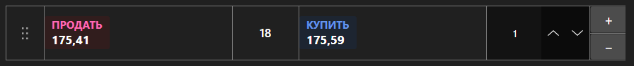

# Панель быстрой торговли



[QuickOrderPanel](xref:StockSharp.Xaml.QuickOrderPanel) - компактная панель выставления заявок в один клик. Показывает лучшие цены покупки и продажи, спред и объём заявки; нажатие на сторону сразу формирует заявку.

**Основные свойства**

- [QuickOrderPanel.Security](xref:StockSharp.Xaml.QuickOrderPanel.Security) - инструмент, по которому выставляются заявки.
- [QuickOrderPanel.Volume](xref:StockSharp.Xaml.QuickOrderPanel.Volume) - объём заявки.
- [QuickOrderPanel.BuyBackground](xref:StockSharp.Xaml.QuickOrderPanel.BuyBackground) - фон стороны покупки.
- [QuickOrderPanel.SellBackground](xref:StockSharp.Xaml.QuickOrderPanel.SellBackground) - фон стороны продажи.

Панель сама заявки не регистрирует \- она лишь формирует объект [Order](xref:StockSharp.BusinessEntities.Order) и передаёт его в событие `RegisterOrder`. Портфель и любые дополнительные проверки добавляются в обработчике. Изменение объёма или оформления вызывает событие `SettingsChanged`, по которому удобно сохранять настройки.

Ниже показаны фрагменты кода с его использованием:

```xaml
<Window x:Class="Sample.QuickOrderWindow"
	xmlns="http://schemas.microsoft.com/winfx/2006/xaml/presentation"
	xmlns:x="http://schemas.microsoft.com/winfx/2006/xaml"
	xmlns:xaml="http://schemas.stocksharp.com/xaml"
	Height="300" Width="260">
	<xaml:QuickOrderPanel x:Name="QuickOrderPanel" Volume="10" />
</Window>
```

```cs
// Задаем инструмент - панель подпишется на его лучшие цены
QuickOrderPanel.Security = _security;

// Панель формирует заявку, регистрируем ее сами
QuickOrderPanel.RegisterOrder += order =>
{
	order.Portfolio = _portfolio;
	_connector.RegisterOrder(order);
};

// Сохраняем настройки при их изменении
QuickOrderPanel.SettingsChanged += () => SaveSettings();
```

## См. также

[Торговля](../trading.md)
