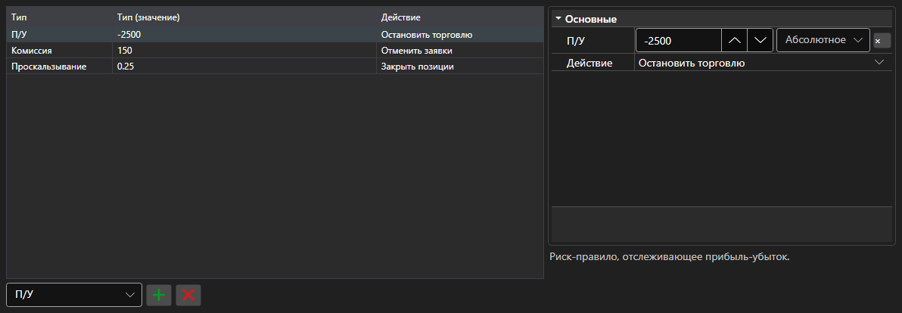

# Правила риск\-менеджмента



[RiskPanel](xref:StockSharp.Xaml.RiskPanel) - таблица правил риск\-менеджмента. Позволяет добавлять, удалять и настраивать правила [IRiskRule](xref:StockSharp.Algo.Risk.IRiskRule): у каждого правила задаются условие срабатывания и действие.

**Основные свойства**

- [RiskPanel.Rules](xref:StockSharp.Xaml.RiskPanel.Rules) - список правил; тот же список, что использует [IRiskManager](xref:StockSharp.Algo.Risk.IRiskManager).

Слева \- список правил: тип, значение условия и действие при срабатывании. Справа \- свойства выбранного правила, у каждого типа свои. Новое правило добавляется выбором типа в списке под таблицей, ненужное удаляется соседней кнопкой. Состав колонок и их ширины сохраняются методами `Save` и `Load`.

Ниже показаны фрагменты кода с его использованием:

```xaml
<Window x:Class="Sample.RiskWindow"
	xmlns="http://schemas.microsoft.com/winfx/2006/xaml/presentation"
	xmlns:x="http://schemas.microsoft.com/winfx/2006/xaml"
	xmlns:xaml="http://schemas.stocksharp.com/xaml"
	Height="400" Width="700">
	<xaml:RiskPanel x:Name="RiskPanel" />
</Window>
```

```cs
// Показываем правила действующего риск-менеджера
RiskPanel.Rules.AddRange(_connector.RiskManager.Rules);

// Добавляем правило: остановка торговли при убытке
RiskPanel.Rules.Add(new RiskPnLRule
{
	PnL = -1000,
	Action = RiskActions.StopTrading,
});

// Возвращаем отредактированные правила в риск-менеджер
_connector.RiskManager.Rules.Clear();
_connector.RiskManager.Rules.AddRange(RiskPanel.Rules);
```

## См. также

[Торговля](../trading.md)
