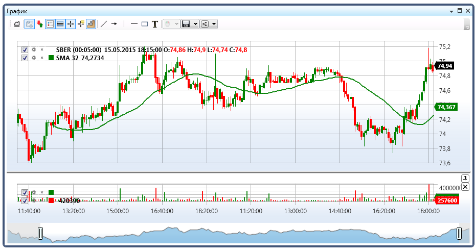

# Добавление индикатора на график

Добавление индикатора для отрисовки на графике демонстрирует следующий пример:

```cs
private readonly Connector _connector = new Connector();
private Security _security;
private Subscription _candleSubscription;
private SimpleMovingAverage _sma;
readonly TimeSpan _timeFrame = TimeSpan.FromMinutes(1);
private ChartArea _area;
private ChartCandleElement _candlesElem;
private ChartIndicatorElement _longMaElem;

// Инициализация графика и индикатора
private void InitializeChart()
{
    // _chart - StockSharp.Xaml.Charting.Chart
    // Создание области графика
    _area = new ChartArea();
    _chart.Areas.Add(_area);
    
    // Создание элемента графика представляющего свечи
    _candlesElem = new ChartCandleElement();
    _area.Elements.Add(_candlesElem);
    
    // Создание элемента графика представляющего индикатор
    _longMaElem = new ChartIndicatorElement
    {
        Title = "Длинная"
    };
    _area.Elements.Add(_longMaElem);
    
    // Создаем индикатор
    _sma = new SimpleMovingAverage() { Length = 80 };
    
    // Подписываемся на событие получения свечей
    _connector.CandleReceived += OnCandleReceived;
}

// Метод для подписки на свечи
private void SubscribeToCandles()
{
    // Создаем подписку на свечи с указанным таймфреймом
    _candleSubscription = new Subscription(
        DataType.TimeFrame(_timeFrame),
        _security)
    {
        MarketData = 
        {
            // Запрашиваем исторические данные за 30 дней
            From = DateTime.Today.Subtract(TimeSpan.FromDays(30)),
            To = DateTime.Now,
            // Получаем только завершенные свечи
            IsFinishedOnly = true
        }
    };
    
    // Запускаем подписку
    _connector.Subscribe(_candleSubscription);
}

// Обработчик события получения свечи
private void OnCandleReceived(Subscription subscription, ICandleMessage candle)
{
    // Проверяем, относится ли свеча к нашей подписке
    if (subscription != _candleSubscription)
        return;
    
    // Проверяем состояние свечи
    if (candle.State != CandleStates.Finished)
        return;
    
    // Обрабатываем свечу индикатором
    var longValue = _sma.Process(candle);
    
    // Создаем данные для отрисовки
    var data = new ChartDrawData();
    data
        .Group(candle.OpenTime)
            .Add(_candlesElem, candle)
            .Add(_longMaElem, longValue);
    
    // Отрисовываем на графике в потоке UI
    this.GuiAsync(() => _chart.Draw(data));
}

// Метод для отписки при закрытии окна
private void UnsubscribeFromCandles()
{
    if (_candleSubscription != null)
    {
        _connector.CandleReceived -= OnCandleReceived;
        _connector.UnSubscribe(_candleSubscription);
        _candleSubscription = null;
    }
}
```



## Пример работы с несколькими индикаторами

```cs
private readonly Connector _connector = new Connector();
private Security _security;
private Subscription _candleSubscription;
private SimpleMovingAverage _shortSma;
private SimpleMovingAverage _longSma;
private ChartArea _mainArea;
private ChartArea _indicatorArea;
private ChartCandleElement _candlesElem;
private ChartIndicatorElement _shortSmaElem;
private ChartIndicatorElement _longSmaElem;
private RelativeStrengthIndex _rsi;
private ChartIndicatorElement _rsiElem;

// Инициализация графика и индикаторов
private void InitializeChartWithMultipleIndicators()
{
    // Создаем основную область для свечей и скользящих средних
    _mainArea = new ChartArea();
    _chart.Areas.Add(_mainArea);
    
    // Создаем область для RSI
    _indicatorArea = new ChartArea();
    _chart.Areas.Add(_indicatorArea);
    
    // Создаем элементы графика
    _candlesElem = new ChartCandleElement();
    _shortSmaElem = new ChartIndicatorElement { Title = "SMA (короткая)" };
    _longSmaElem = new ChartIndicatorElement { Title = "SMA (длинная)" };
    _rsiElem = new ChartIndicatorElement { Title = "RSI" };
    
    // Настраиваем цвета элементов
    _shortSmaElem.Color = Colors.Red;
    _longSmaElem.Color = Colors.Blue;
    _rsiElem.Color = Colors.Green;
    
    // Добавляем элементы на соответствующие области
    _mainArea.Elements.Add(_candlesElem);
    _mainArea.Elements.Add(_shortSmaElem);
    _mainArea.Elements.Add(_longSmaElem);
    _indicatorArea.Elements.Add(_rsiElem);
    
    // Создаем индикаторы
    _shortSma = new SimpleMovingAverage { Length = 9 };
    _longSma = new SimpleMovingAverage { Length = 20 };
    _rsi = new RelativeStrengthIndex { Length = 14 };
    
    // Подписываемся на событие получения свечей
    _connector.CandleReceived += OnCandleReceivedMultipleIndicators;
    
    // Создаем подписку на свечи
    _candleSubscription = new Subscription(
        DataType.TimeFrame(TimeSpan.FromMinutes(5)),
        _security)
    {
        MarketData = 
        {
            From = DateTime.Today.Subtract(TimeSpan.FromDays(30)),
            To = DateTime.Now,
            IsFinishedOnly = true
        }
    };
    
    // Запускаем подписку
    _connector.Subscribe(_candleSubscription);
}

// Обработчик события получения свечи для нескольких индикаторов
private void OnCandleReceivedMultipleIndicators(Subscription subscription, ICandleMessage candle)
{
    // Проверяем, относится ли свеча к нашей подписке
    if (subscription != _candleSubscription)
        return;
    
    if (candle.State != CandleStates.Finished)
        return;
    
    // Обрабатываем свечу индикаторами
    var shortSmaValue = _shortSma.Process(candle);
    var longSmaValue = _longSma.Process(candle);
    var rsiValue = _rsi.Process(candle);
    
    // Создаем данные для отрисовки
    var data = new ChartDrawData();
    data
        .Group(candle.OpenTime)
            .Add(_candlesElem, candle)
            .Add(_shortSmaElem, shortSmaValue)
            .Add(_longSmaElem, longSmaValue)
            .Add(_rsiElem, rsiValue);
    
    // Отрисовываем на графике в потоке UI
    this.GuiAsync(() => _chart.Draw(data));
}
```

## См. также

[Компоненты для построения графиков](../graphical_user_interface/charts.md)