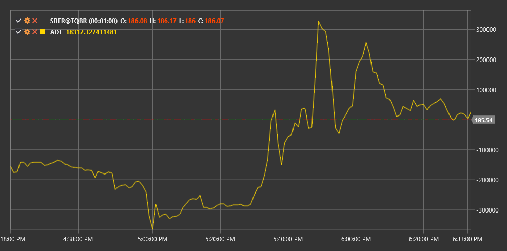

# ADL

**Линия накопления/распределения (Accumulation/Distribution Line, ADL)** - это индикатор объема, который был разработан Марком Чайкиным. Индикатор оценивает соотношение спроса и предложения на рынке путем анализа взаимосвязи цены и объема.

Для использования индикатора необходимо использовать класс [AccumulationDistributionLine](xref:StockSharp.Algo.Indicators.AccumulationDistributionLine).

## Описание

Линия накопления/распределения является кумулятивным индикатором, который использует объем и цену для определения, находится ли ценная бумага в стадии накопления (покупка) или распределения (продажа).

Индикатор ADL помогает подтвердить тренд или предупредить о его потенциальном развороте:
- Если цена растет, а ADL падает, это может сигнализировать о слабости восходящего тренда.
- Если цена падает, а ADL растет, это может указывать на возможный разворот нисходящего тренда.

## Расчет

Расчет линии накопления/распределения происходит в два этапа:

**1. Расчет множителя объема (CLV - Close Location Value):**
```
CLV = ((Close - Low) - (High - Close)) / (High - Low)
```

**2. Расчет ADL:**
```
ADL = Предыдущее значение ADL + CLV * Volume
```

где:
- Close - цена закрытия периода
- Low - минимальная цена периода
- High - максимальная цена периода
- Volume - объем торгов за период

Если (High - Low) равно нулю, CLV принимается равным нулю.



## См. также

[OBV](on_balance_volume.md)