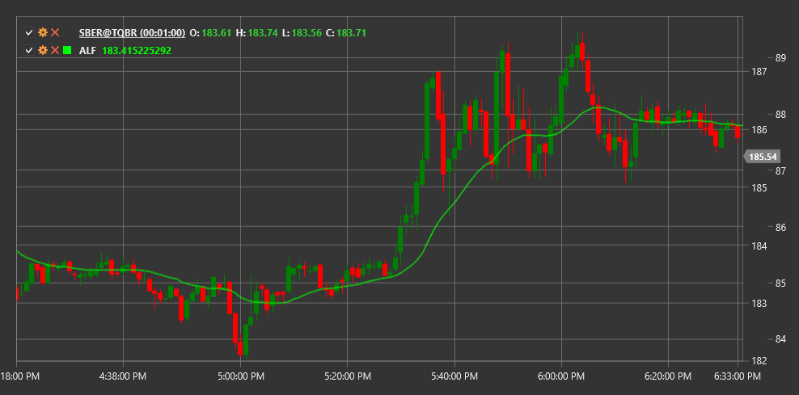

# ALF

**Адаптивный фильтр Лагерра (Adaptive Laguerre Filter, ALF)** - это индикатор, разработанный для сглаживания ценовых данных с минимальным запаздыванием, основанный на математических принципах фильтра Лагерра.

Для использования индикатора необходимо использовать класс [AdaptiveLaguerreFilter](xref:StockSharp.Algo.Indicators.AdaptiveLaguerreFilter).

## Описание

Адаптивный фильтр Лагерра - это продвинутый инструмент фильтрации шума на рынке. Он обеспечивает более плавное представление ценового движения при сохранении быстрой реакции на реальные изменения тренда. Этот фильтр особенно полезен для снижения запаздывания, которое часто встречается в традиционных сглаживающих индикаторах.

Основное преимущество ALF перед классическими скользящими средними состоит в его способности более эффективно отделять рыночный шум от настоящих ценовых движений, что делает его ценным инструментом для трейдеров, стремящихся снизить количество ложных сигналов.

## Параметры

Индикатор имеет следующие параметры:
- **Gamma** - коэффициент фильтрации (обычно в диапазоне от 0.1 до 0.9)

Параметр Gamma определяет степень сглаживания: более низкие значения создают более сглаженную линию с большим запаздыванием, в то время как более высокие значения приводят к меньшему сглаживанию, но более быстрой реакции на изменения цены.

## Расчет

Адаптивный фильтр Лагерра основан на полиномах Лагерра и представляет собой систему фильтрации с конечной импульсной характеристикой (FIR). Расчет использует следующие формулы:

1. Вычисляются промежуточные значения L0, L1, L2 и L3:
   ```
   L0(t) = (1 - γ) * price(t) + γ * L0(t-1)
   L1(t) = -γ * L0(t) + L0(t-1) + γ * L1(t-1)
   L2(t) = -γ * L1(t) + L1(t-1) + γ * L2(t-1)
   L3(t) = -γ * L2(t) + L2(t-1) + γ * L3(t-1)
   ```

2. Итоговое значение фильтра ALF вычисляется как среднее значение:
   ```
   ALF = (L0 + L1 + L2 + L3) / 4
   ```

где:
- γ (gamma) - коэффициент фильтрации
- price(t) - текущая цена
- L0, L1, L2, L3 - промежуточные значения фильтра



## См. также

[LaguerreRSI](laguerre_rsi.md)
[ZLEMA](zero_lag_exponential_moving_average.md)