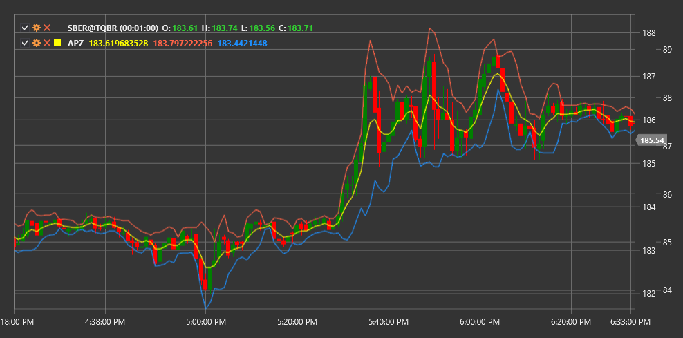

# APZ

**Адаптивная ценовая зона (Adaptive Price Zone, APZ)** - это технический индикатор, разработанный Ли Лейбфарбом, который создает динамические зоны поддержки и сопротивления, адаптируясь к волатильности рынка.

Для использования индикатора необходимо использовать класс [AdaptivePriceZone](xref:StockSharp.Algo.Indicators.AdaptivePriceZone).

## Описание

Индикатор APZ состоит из двух линий (верхней и нижней), которые образуют ценовую зону вокруг средней цены. Эта зона расширяется и сужается в зависимости от текущей волатильности рынка. Когда рынок становится более волатильным, зона расширяется; когда волатильность снижается, зона сужается.

APZ особенно полезен для:
- Определения потенциальных уровней поддержки и сопротивления
- Обнаружения возможных точек разворота тренда
- Выявления периодов повышенной и пониженной волатильности
- Создания торговых систем на основе пробоя ценовой зоны

## Параметры

Индикатор имеет следующие параметры:
- **Period** - период расчета (стандартное значение: 5)
- **BandPercentage** - процент диапазона для определения ширины полосы (стандартное значение: 2%)

## Расчет

Расчет APZ основан на экспоненциальном скользящем среднем (EMA) и среднем истинном диапазоне (ATR):

1. Сначала рассчитывается EMA цены за указанный период:
   ```
   EMA = Экспоненциальное скользящее среднее от цены за период Period
   ```

2. Затем рассчитывается волатильность с использованием ATR:
   ```
   Волатильность = Экспоненциальное скользящее среднее от ATR за период Period
   ```

3. Верхняя и нижняя линии APZ вычисляются следующим образом:
   ```
   Верхняя линия = EMA + (Волатильность * BandPercentage)
   Нижняя линия = EMA - (Волатильность * BandPercentage)
   ```

Когда цена находится выше верхней линии APZ, это может рассматриваться как восходящий тренд. Когда цена находится ниже нижней линии APZ, это может указывать на нисходящий тренд. Когда цена перемещается внутри зоны APZ, рынок может находиться в фазе консолидации или боковом движении.



## См. также

[BollingerBands](bollinger_bands.md)
[KeltnerChannels](keltner_channels.md)
[DonchianChannels](donchian_channels.md)