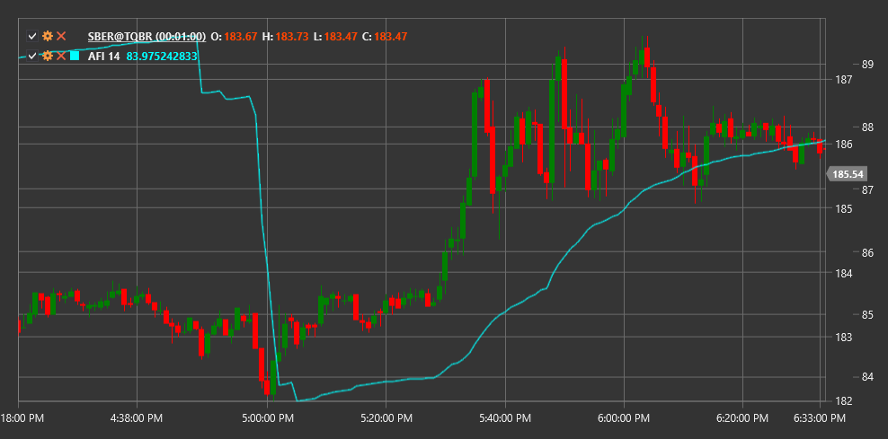

# AFI

**Индекс потока утверждения (Approval Flow Index, AFI)** - это индикатор, который измеряет силу тренда, основываясь на соотношении объема и движении цены.

Для использования индикатора необходимо использовать класс [ApprovalFlowIndex](xref:StockSharp.Algo.Indicators.ApprovalFlowIndex).

## Описание

Индекс потока утверждения (AFI) помогает оценить интенсивность потока ордеров на рынке и определить силу текущего тренда. Этот индикатор анализирует взаимосвязь между объемом торгов и движением цены, чтобы выявить потенциальные точки разворота или подтвердить продолжение тренда.

Индикатор AFI может использоваться для:
- Определения силы текущего тренда
- Выявления дивергенций между ценой и индикатором
- Поиска потенциальных точек разворота рынка

## Параметры

Индикатор имеет следующие параметры:
- **Length** - период расчета индикатора

## Расчет

Расчет индекса потока утверждения основан на анализе изменения цены и объема за определенный период:

1. Сначала рассчитывается изменение цены за период
2. Затем это изменение соотносится с объемом торгов
3. Полученные значения суммируются за выбранный период (параметр Length)

AFI стремится определить, насколько объем торгов "подтверждает" движение цены.

Положительные значения AFI указывают на сильный восходящий тренд, в то время как отрицательные значения свидетельствуют о нисходящем тренде. Значения, близкие к нулю, могут указывать на отсутствие ярко выраженного тренда.

## См. также

[ADL](accumulation_distribution_line.md)
[OBV](obv.md)