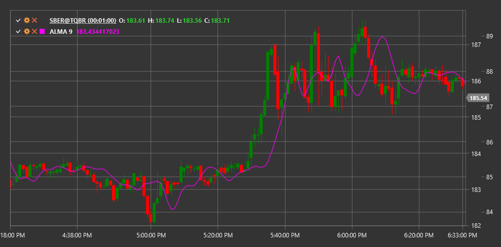

# ALMA

**Скользящее среднее Арно Легу (Arnaud Legoux Moving Average, ALMA)** - это индикатор, разработанный Арно Легу и оптимизированный для устранения рыночного шума и снижения задержки сигнала.

Для использования индикатора необходимо использовать класс [ArnaudLegouxMovingAverage](xref:StockSharp.Algo.Indicators.ArnaudLegouxMovingAverage).

## Описание

ALMA сочетает в себе преимущества двух подходов к сглаживанию данных:
1. Устранение шума рынка (как и большинство скользящих средних)
2. Минимизация задержки (характерной для многих сглаживающих индикаторов)

Индикатор ALMA использует нормальное (гауссово) распределение в качестве весовой функции, которое может быть настроено с помощью параметров смещения и сигмы. Это делает его очень гибким и эффективным инструментом для технического анализа.

ALMA используется для:
- Определения текущего тренда
- Выявления точек разворота
- Создания торговых систем на основе пересечений

## Параметры

Индикатор имеет следующие параметры:
- **Length** - период расчета (количество свечей для анализа)
- **Sigma** - сигма, параметр, контролирующий форму гауссовой кривой (рекомендуемое значение: 6)
- **Offset** - смещение, параметр, контролирующий сглаживание и скорость реакции (рекомендуемое значение: 0.85)

## Расчет

Расчет ALMA происходит в несколько этапов:

1. Определение весов для каждой точки данных в окне на основе нормального (гауссового) распределения:
   ```
   m = floor(Offset * (Length - 1))
   s = Length / Sigma
   
   Для каждого i от 0 до Length-1:
   w(i) = exp(-((i - m)^2) / (2 * s^2))
   ```

2. Нормализация весов:
   ```
   Сумма_весов = сумма всех w(i)
   
   Для каждого i от 0 до Length-1:
   w_norm(i) = w(i) / Сумма_весов
   ```

3. Расчет ALMA как взвешенной суммы:
   ```
   ALMA = сумма(Цена(t-i) * w_norm(i)) для всех i от 0 до Length-1
   ```

где:
- Length - период ALMA
- Offset - параметр смещения (от 0 до 1)
- Sigma - параметр сигмы (обычно от 2 до 8)



## См. также

[SMA](sma.md)
[EMA](ema.md)
[T3MA](t3_moving_average.md)
[ZLEMA](zero_lag_exponential_moving_average.md)