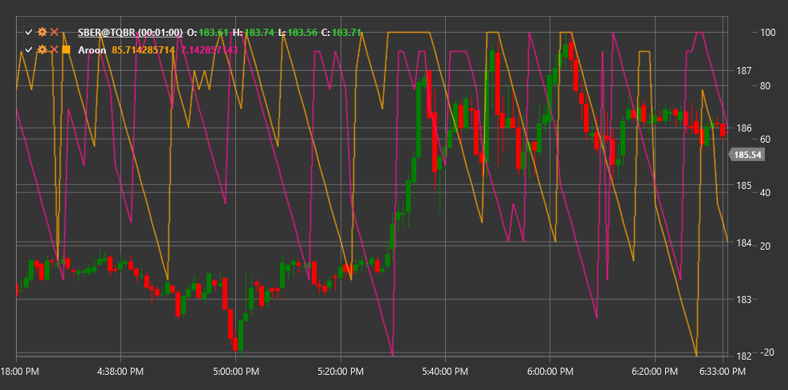

# Арун

**Индикатор Aroon** - это технический индикатор, разработанный Тушаром Чанде в 1995 году для определения изменений тренда и силы тренда. Название "Aroon" происходит от санскритского слова, означающего "рассвет новой эры".

Для использования индикатора необходимо использовать класс [Aroon](xref:StockSharp.Algo.Indicators.Aroon).

## Описание

Индикатор Aroon состоит из двух линий:
- **Aroon Up** - измеряет силу восходящего тренда
- **Aroon Down** - измеряет силу нисходящего тренда

Aroon помогает определить:
- Начало нового тренда
- Силу текущего тренда
- Консолидацию и боковое движение
- Потенциальные развороты тренда

Индикатор особенно полезен для выявления ранних стадий формирования нового тренда, а также для определения периодов консолидации.

## Параметры

Индикатор имеет следующие параметры:
- **Length** - период расчета (обычно используют 14-25 периодов)

## Расчет

Расчет индикатора Aroon основан на определении времени (количества периодов), прошедшего с момента достижения максимальной и минимальной цены в пределах заданного периода:

1. Aroon Up рассчитывается по формуле:
   ```
   Aroon Up = ((Length - Периоды с максимума) / Length) * 100
   ```

2. Aroon Down рассчитывается по формуле:
   ```
   Aroon Down = ((Length - Периоды с минимума) / Length) * 100
   ```

где:
- Length - выбранный период
- "Периоды с максимума" - количество периодов с момента достижения максимальной цены в пределах периода Length
- "Периоды с минимума" - количество периодов с момента достижения минимальной цены в пределах периода Length

Обе линии Aroon колеблются в диапазоне от 0 до 100:
- Значение 100 означает, что максимум/минимум был достигнут в самом последнем периоде
- Значение 0 означает, что максимум/минимум был достигнут Length периодов назад

## Интерпретация

- **Сильный восходящий тренд**: Aroon Up близок к 100, а Aroon Down близок к 0
- **Сильный нисходящий тренд**: Aroon Down близок к 100, а Aroon Up близок к 0
- **Боковое движение**: обе линии движутся параллельно друг другу на низких уровнях
- **Потенциальный разворот тренда**: пересечение линий Aroon Up и Aroon Down
- **Консолидация**: обе линии колеблются около 50



## См. также

[ADX](adx.md)
[DMI](dmi.md)