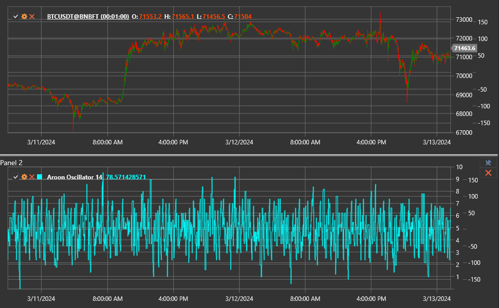

# Aroon Oscillator

**Осциллятор Aroon** — это вспомогательный индикатор из семейства Aroon, измеряющий разницу между линиями Aroon Up и Aroon Down. 
Он помогает определить доминирующее направление рынка и силу тренда, показывая, какая сторона — покупатели или продавцы — 
контролирует ситуацию.

Для использования индикатора необходимо применять класс [AroonOscillator](xref:StockSharp.Algo.Indicators.AroonOscillator).

## Описание

Осциллятор Aroon принимает значения в диапазоне от −100 до +100:

- положительные значения показывают, что линия Aroon Up находится выше Aroon Down и на рынке преобладает восходящее движение;
- отрицательные значения свидетельствуют о превосходстве линии Aroon Down и о доминировании нисходящего тренда;
- значения около нуля указывают на баланс сил или консолидацию.

Чем дальше значение от нуля, тем увереннее соответствующий тренд.

## Параметры

Индикатор использует один параметр:

- **Length** — длина окна для расчёта линий Aroon. Чем больше длина, тем более сглаженными будут значения и тем медленнее индикатор
  реагирует на изменения тренда.

## Расчёт

1. Рассчитываются значения Aroon Up и Aroon Down с указанным периодом Length.
2. Осциллятор определяется как разность линий:  
   `Aroon Oscillator = Aroon Up − Aroon Down`.

## Интерпретация

- **Aroon Oscillator > 0** — подтверждение восходящего движения.
- **Aroon Oscillator < 0** — преобладание нисходящего движения.
- **Пересечение нулевой линии** — возможная смена доминирующего тренда.
- **Экстремальные значения** — сильный тренд; часто используются в качестве фильтра для входа по направлению движения.

Индикатор часто применяют совместно с базовым индикатором Aroon, чтобы одновременно видеть абсолютные уровни линий и разницу между
ними.

## См. также

[Aroon](aroon.md)
[ADX](adx.md)
[DMI](dmi.md)
