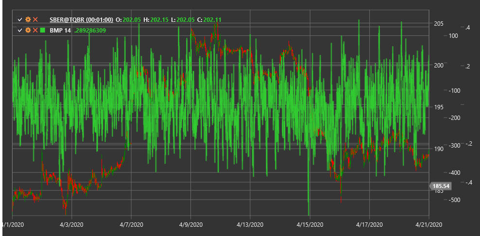

# BMP

**Баланс рыночной силы (Balance of Market Power, BMP)** - это индикатор, который измеряет силу покупателей по отношению к силе продавцов, основываясь на анализе ценовых движений и объемов торгов.

Для использования индикатора необходимо использовать класс [BalanceOfMarketPower](xref:StockSharp.Algo.Indicators.BalanceOfMarketPower).

## Описание

Индикатор "Баланс рыночной силы" предназначен для оценки текущего распределения сил между покупателями и продавцами на рынке. Он анализирует, насколько сильно закрытие цены отклоняется от ее диапазона (максимум-минимум) и соотносит это с объемом торгов.

BMP помогает трейдерам:
- Определить доминирующую сторону рынка (покупатели или продавцы)
- Выявить потенциальные развороты тренда
- Обнаружить дивергенции между ценой и индикатором
- Найти уровни перекупленности и перепроданности

## Параметры

Индикатор имеет следующие параметры:
- **Length** - период сглаживания (стандартное значение: 14)

## Расчет

Расчет BMP происходит в два этапа:

1. Вычисление BMP для каждой отдельной свечи:
   ```
   Сырой BMP = ((Цена закрытия - Цена открытия) / (Максимум - Минимум)) * Объем
   ```
   В случае, если (Максимум - Минимум) равен нулю, сырой BMP принимается равным нулю.

2. Сглаживание BMP с помощью простого скользящего среднего (SMA):
   ```
   BMP = SMA(Сырой BMP, Length)
   ```

где:
- Цена закрытия - цена закрытия текущей свечи
- Цена открытия - цена открытия текущей свечи
- Максимум - максимальная цена текущей свечи
- Минимум - минимальная цена текущей свечи
- Объем - объем торгов за период текущей свечи
- Length - выбранный период сглаживания

## Интерпретация

- **Положительные значения BMP** указывают на доминирование покупателей (быков) на рынке
- **Отрицательные значения BMP** указывают на доминирование продавцов (медведей) на рынке
- **Пересечение нулевой линии** может рассматриваться как сигнал смены тренда
- **Экстремальные значения** (выше или ниже определенных уровней) могут указывать на перекупленность или перепроданность рынка
- **Дивергенции** между BMP и ценой могут сигнализировать о потенциальном развороте тренда



## См. также

[BalanceOfPower](balance_of_power.md)
[ForceIndex](force_index.md)
[ADL](accumulation_distribution_line.md)
[OBV](on_balance_volume.md)