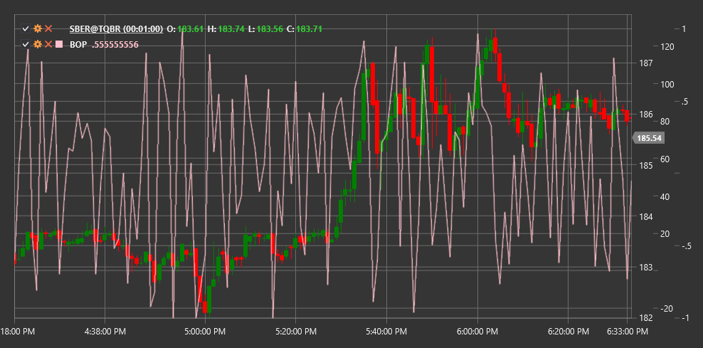

# BOP

**Баланс сил (Balance of Power, BOP)** - это индикатор, разработанный для измерения силы быков (покупателей) по отношению к силе медведей (продавцов) путем оценки способности быков поднимать цену от минимума к максимуму.

Для использования индикатора необходимо использовать класс [BalanceOfPower](xref:StockSharp.Algo.Indicators.BalanceOfPower).

## Описание

Индикатор Balance of Power (BOP) отображает соотношение сил между покупателями и продавцами на рынке. Он основан на предположении, что в тренде покупатели (быки) или продавцы (медведи) могут контролировать цену на протяжении всей сессии. Сравнивая разницу между ценой закрытия и открытия с полным диапазоном цен (максимум-минимум), индикатор позволяет оценить, кто доминирует на рынке в данный момент.

BOP помогает трейдерам:
- Определить направление и силу текущего тренда
- Выявить потенциальные точки разворота
- Обнаружить дивергенции между ценой и индикатором
- Определить уровни перекупленности и перепроданности

## Расчет

Формула для расчета индикатора Balance of Power (BOP) довольно проста:

```
BOP = (Close - Open) / (High - Low)
```

где:
- Close - цена закрытия
- Open - цена открытия
- High - максимальная цена за период
- Low - минимальная цена за период

Если (High - Low) равно нулю, BOP принимается равным нулю для избежания деления на ноль.

Часто BOP дополнительно сглаживается с помощью скользящего среднего для снижения волатильности и улучшения читаемости сигналов.

## Интерпретация

- **Положительные значения BOP** (выше нуля) указывают на то, что покупатели (быки) контролируют рынок, что может сигнализировать о восходящем тренде.
- **Отрицательные значения BOP** (ниже нуля) указывают на то, что продавцы (медведи) контролируют рынок, что может сигнализировать о нисходящем тренде.
- **Пересечение нулевой линии** может рассматриваться как сигнал потенциального изменения направления тренда.
- **Экстремальные значения** (сильно положительные или сильно отрицательные) могут указывать на перекупленность или перепроданность рынка.
- **Дивергенции** между BOP и ценой могут сигнализировать о возможном развороте тренда:
  - Если цена растет, а BOP падает, это может быть предупреждением о ослаблении восходящего тренда.
  - Если цена падает, а BOP растет, это может указывать на потенциальное окончание нисходящего тренда.



## См. также

[BalanceOfMarketPower](balance_of_market_power.md)
[ForceIndex](force_index.md)
[ADL](accumulation_distribution_line.md)
[OBV](obv.md)