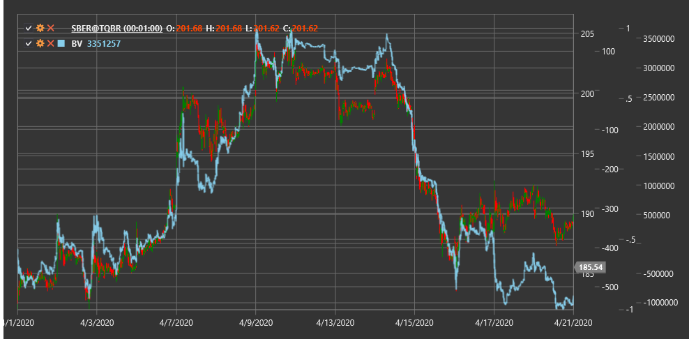

# BV

**Индикатор объема баланса (Balance Volume, BV)** - это технический индикатор, который отслеживает накопление и распределение объема торгов, основываясь на изменении цены.

Для использования индикатора необходимо использовать класс [BalanceVolume](xref:StockSharp.Algo.Indicators.BalanceVolume).

## Описание

Индикатор объема баланса (BV) разработан для анализа соотношения между изменением цены и объемом торгов. Он помогает трейдерам определить, насколько изменения объема соответствуют движению цены, что может указывать на силу или слабость текущего тренда.

Основная идея BV заключается в том, что объем должен подтверждать направление движения цены. Если цена растет при увеличении объема, это указывает на сильный восходящий тренд. И наоборот, если цена падает при увеличении объема, это говорит о сильном нисходящем тренде.

Индикатор BV особенно полезен для:
- Подтверждения силы текущего тренда
- Выявления потенциальных разворотов тренда
- Обнаружения дивергенций между ценой и объемом
- Определения уровней накопления и распределения

## Расчет

Расчет индикатора Balance Volume основан на сравнении цены закрытия с предыдущей ценой закрытия и взвешивании объема торгов:

```
Если Close > Close(предыдущий):
    BV = BV(предыдущий) + Volume
Если Close < Close(предыдущий):
    BV = BV(предыдущий) - Volume
Если Close = Close(предыдущий):
    BV = BV(предыдущий)
```

где:
- Close - текущая цена закрытия
- Close(предыдущий) - предыдущая цена закрытия
- Volume - текущий объем торгов
- BV(предыдущий) - предыдущее значение индикатора Balance Volume

## Интерпретация

- **Рост BV вместе с ростом цены** - подтверждение восходящего тренда, указывает на сильный интерес покупателей
- **Падение BV вместе с падением цены** - подтверждение нисходящего тренда, указывает на сильный интерес продавцов
- **Рост BV при стабильной или падающей цене** - потенциальное накопление, может предшествовать развороту вверх
- **Падение BV при стабильной или растущей цене** - потенциальное распределение, может предшествовать развороту вниз
- **Дивергенция между BV и ценой** - предупреждение о возможном развороте тренда:
  - Если цена растет, а BV падает, возможен скорый разворот вниз
  - Если цена падает, а BV растет, возможен скорый разворот вверх



## См. также

[OBV](on_balance_volume.md)
[ADL](accumulation_distribution_line.md)
[ChaikinMoneyFlow](chaikin_money_flow.md)
[ForceIndex](force_index.md)