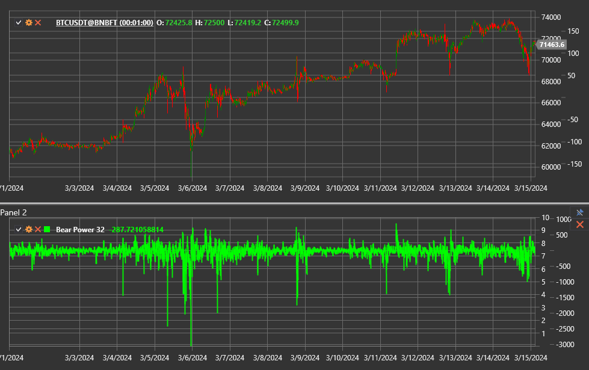

# Bear Power

**Bear Power** — индикатор из системы Elder-ray, показывающий силу продавцов относительно экспоненциальной скользящей средней
(EMA). Он оценивает, насколько далеко внутридневные минимумы уходят ниже среднего значения цены и помогает выявлять моменты, когда
медведи теряют контроль над рынком.

Для использования индикатора необходимо применять класс [BearPower](xref:StockSharp.Algo.Indicators.BearPower).

## Описание

Значение Bear Power рассчитывается как разница между минимальной ценой свечи и значением экспоненциальной скользящей средней:

`Bear Power = Low − EMA`.

- отрицательные значения показывают преобладание продавцов и давление на цену;
- рост показателя к нулю или выше нуля указывает на ослабление медведей и возможный разворот вверх;
- экстремально низкие значения свидетельствуют о панических распродажах и часто предшествуют отскоку.

## Параметры

Индикатор использует параметры EMA, унаследованные от [ExponentialMovingAverage](xref:StockSharp.Algo.Indicators.ExponentialMovingAverage):

- **Length** — период сглаживания EMA;
- **Alpha** (при необходимости) — коэффициент сглаживания, если вместо периода используется явное значение.

## Использование

- Входные сигналы появляются, когда значение Bear Power разворачивается вверх после экстремального минимума, особенно если EMA
  направлена вверх.
- Пересечение уровня 0 может рассматриваться как подтверждение смены тренда.
- Индикатор обычно анализируется совместно с [Bull Power](bull_power.md) и EMA цены, формируя комплексный индикатор
  [Elder Ray](elder_ray.md).

## См. также

[Bull Power](bull_power.md)
[Elder Ray](elder_ray.md)
[ExponentialMovingAverage](ema.md)
