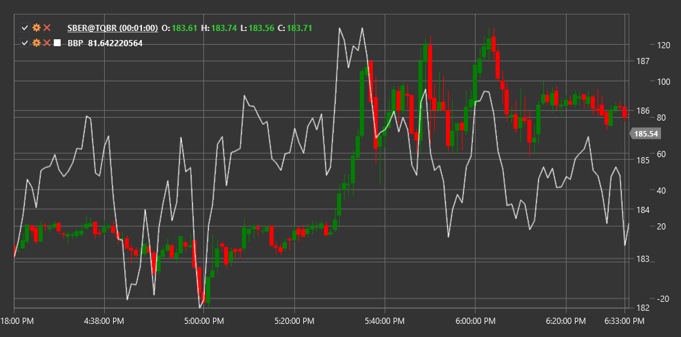

# BBP

**Bollinger %b (Bollinger Percent B, BBP)** - это индикатор, разработанный Джоном Боллинджером как дополнение к индикатору Bollinger Bands. BBP показывает местоположение цены относительно верхней и нижней полос Боллинджера.

Для использования индикатора необходимо использовать класс [BollingerPercentB](xref:StockSharp.Algo.Indicators.BollingerPercentB).

## Описание

Индикатор Bollinger %b определяет позицию цены относительно верхней и нижней полос Боллинджера в виде процентного значения от 0 до 1 (или от 0% до 100%). Это позволяет более точно определить положение цены в контексте полос Боллинджера:

- Значение 1 (или 100%) означает, что цена находится на верхней полосе Боллинджера.
- Значение 0 (или 0%) означает, что цена находится на нижней полосе Боллинджера.
- Значение 0.5 (или 50%) означает, что цена находится на средней линии Боллинджера (SMA).

BBP также может принимать значения за пределами диапазона 0-1:
- Значения выше 1 указывают на то, что цена находится выше верхней полосы Боллинджера.
- Значения ниже 0 указывают на то, что цена находится ниже нижней полосы Боллинджера.

## Параметры

Индикатор имеет следующие параметры:
- **Length** - период расчета SMA (стандартное значение: 20)
- **StdDevMultiplier** - множитель стандартного отклонения для расчета полос Боллинджера (стандартное значение: 2)

## Расчет

Расчет Bollinger %b основан на формуле:

```
BBP = (Цена - Нижняя полоса Боллинджера) / (Верхняя полоса Боллинджера - Нижняя полоса Боллинджера)
```

где:
- Цена - текущая цена (обычно цена закрытия)
- Нижняя полоса Боллинджера = SMA - (StdDevMultiplier * Стандартное отклонение)
- Верхняя полоса Боллинджера = SMA + (StdDevMultiplier * Стандартное отклонение)
- SMA - простое скользящее среднее за период Length
- Стандартное отклонение - стандартное отклонение цены за период Length

## Использование

Bollinger %b может использоваться различными способами:

1. **Определение перекупленности/перепроданности**:
   - Значения выше 1 указывают на перекупленность рынка
   - Значения ниже 0 указывают на перепроданность рынка

2. **Сигналы разворота**:
   - Когда BBP возвращается в диапазон 0-1 после выхода за его пределы
   - Дивергенции между BBP и ценой

3. **Определение тренда**:
   - Значения BBP, стабильно находящиеся выше 0.5, указывают на восходящий тренд
   - Значения BBP, стабильно находящиеся ниже 0.5, указывают на нисходящий тренд

4. **Поиск скрытых уровней поддержки и сопротивления**:
   - Уровни 0.8 и 0.2 часто используются как дополнительные уровни поддержки и сопротивления



## См. также

[BollingerBands](bollinger_bands.md)
[StdDev](standard_deviation.md)
[RSI](rsi.md)