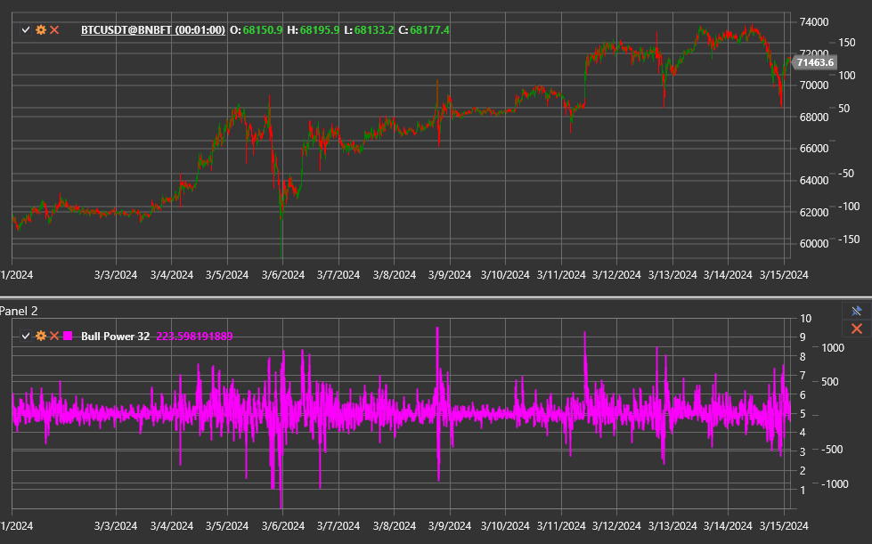

# Bull Power

**Bull Power** — компонент системы Elder-ray, который измеряет силу покупателей относительно экспоненциальной скользящей средней
(EMA). Он отражает, насколько высоко внутридневные максимумы поднимаются над средним значением цены.

Для использования индикатора необходимо применять класс [BullPower](xref:StockSharp.Algo.Indicators.BullPower).

## Описание

Индикатор вычисляется по формуле:

`Bull Power = High − EMA`.

- положительные значения показывают доминирование покупателей и подтверждают восходящий тренд;
- падение показателя к нулю и ниже нуля сигнализирует об ослаблении быков;
- экстремальные максимумы часто предшествуют коррекции, особенно если EMA направлена вниз.

## Параметры

Bull Power наследует настройки [ExponentialMovingAverage](xref:StockSharp.Algo.Indicators.ExponentialMovingAverage):

- **Length** — период сглаживания EMA;
- **Alpha** (опционально) — коэффициент сглаживания.

## Использование

- Рост Bull Power одновременно с растущей EMA подтверждает устойчивый восходящий тренд.
- Дивергенции между ценой и Bull Power (новые максимумы цены без роста индикатора) предупреждают о вероятном развороте.
- Индикатор применяют совместно с [Bear Power](bear_power.md) для оценки баланса сил и построения комплексного индикатора
  [Elder Ray](elder_ray.md).

## См. также

[Bear Power](bear_power.md)
[Elder Ray](elder_ray.md)
[ExponentialMovingAverage](ema.md)
