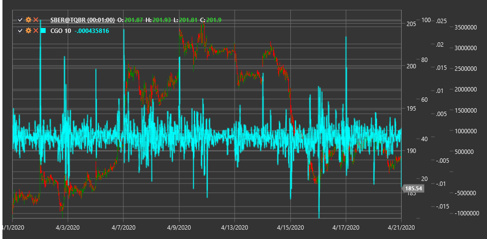

# CGO

**Осциллятор центра тяжести (Center of Gravity Oscillator, CGO)** - это технический индикатор, разработанный Джоном Элерсом, который основывается на концепции центра тяжести в физике и применяет ее к анализу ценового движения на рынке.

Для использования индикатора необходимо использовать класс [CenterOfGravityOscillator](xref:StockSharp.Algo.Indicators.CenterOfGravityOscillator).

## Описание

Осциллятор центра тяжести (CGO) — это ведущий индикатор, который пытается идентифицировать точки разворота на рынке, рассматривая ценовой ряд как физическую систему и определяя ее "центр тяжести". Индикатор рассчитывает, где находится "равновесие" в текущих ценовых движениях, и использует эту информацию для прогнозирования будущих изменений направления тренда.

CGO особенно полезен для:
- Определения потенциальных точек разворота до их появления на графике цены
- Выявления силы и слабости текущего тренда
- Обнаружения скрытых дивергенций между ценой и индикатором
- Создания торговых систем на основе опережающих сигналов

## Параметры

Индикатор имеет следующие параметры:
- **Length** - период расчета (стандартное значение: 10)

## Расчет

Расчет осциллятора центра тяжести (CGO) основан на формуле:

```
CGO = - Сумма(Цена(i) * (i + 1)) / Сумма(Цена(i))
```

где:
- i - индекс ценового значения в периоде от 0 до (Length-1)
- Цена(i) - цена (обычно цена закрытия) для соответствующего индекса i
- Сумма - сумма по всем значениям в периоде Length

В данной формуле каждая цена взвешивается по ее положению во временном ряду, а затем нормализуется общей суммой цен. Знак минус перед формулой добавлен для того, чтобы индикатор рос, когда цена растет, что делает его более интуитивно понятным.

## Интерпретация

- **Пересечение нулевой линии**: Когда CGO пересекает нулевую линию снизу вверх, это может рассматриваться как бычий сигнал. Пересечение сверху вниз может указывать на медвежий сигнал.

- **Экстремумы индикатора**: Когда CGO достигает экстремумов (максимумов или минимумов), это может указывать на потенциальный разворот тренда.

- **Дивергенции**: 
  - Бычья дивергенция: когда цена образует новый минимум, а CGO не подтверждает его, формируя более высокий минимум.
  - Медвежья дивергенция: когда цена достигает нового максимума, а CGO формирует более низкий максимум.

- **Движение индикатора**: Быстрое движение CGO в одном направлении может указывать на начало нового тренда. Если индикатор движется медленно или колеблется около нулевой линии, это может указывать на консолидацию рынка.

Поскольку CGO является опережающим индикатором, его сигналы часто появляются до соответствующих изменений на графике цены, что дает трейдерам преимущество при принятии торговых решений.



## См. также

[SineWave](sine_wave.md)
[HarmonicOscillator](harmonic_oscillator.md)
[FisherTransform](ehlers_fisher_transform.md)
[RVI](rvi.md)