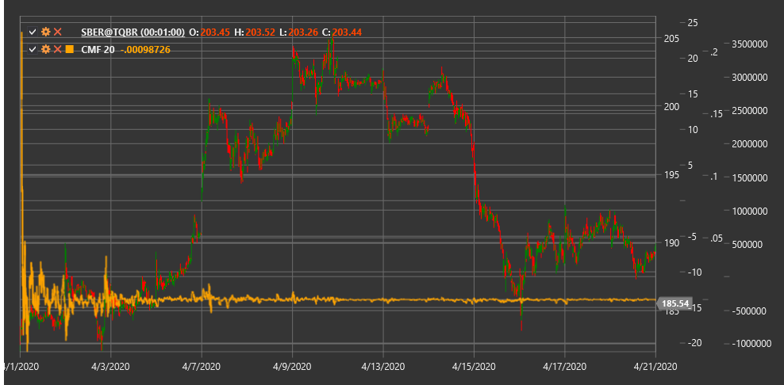

# CMF

**Chaikin Money Flow (CMF)** - это технический индикатор, разработанный Марком Чайкиным, который измеряет силу денежного потока (накопление и распределение) на рынке за определенный период.

Для использования индикатора необходимо использовать класс [ChaikinMoneyFlow](xref:StockSharp.Algo.Indicators.ChaikinMoneyFlow).

## Описание

Chaikin Money Flow (CMF) расширяет концепцию линии накопления/распределения (A/D Line), концентрируясь на определенном периоде времени. Индикатор измеряет объем денежного потока, выраженный в процентах, от общего объема за указанный период.

CMF помогает трейдерам:
- Определить силу давления покупателей и продавцов
- Выявить тенденции накопления (покупки) и распределения (продажи)
- Обнаружить дивергенции между движением цены и денежным потоком
- Получить подтверждение текущего тренда или его слабости

Ключевая идея CMF заключается в том, что в сильном восходящем тренде цена закрытия должна быть ближе к максимуму периода, а в сильном нисходящем тренде - ближе к минимуму.

## Параметры

Индикатор имеет следующие параметры:
- **Length** - период расчета (стандартное значение: 20-21 день)

## Расчет

Расчет CMF включает следующие этапы:

1. Расчет множителя объема (Money Flow Multiplier) для каждого периода:
   ```
   Money Flow Multiplier = ((Close - Low) - (High - Close)) / (High - Low)
   ```
   
   Если (High - Low) = 0, то Money Flow Multiplier = 0.

2. Расчет денежного потока за период (Money Flow Volume):
   ```
   Money Flow Volume = Money Flow Multiplier * Volume
   ```

3. Расчет Chaikin Money Flow:
   ```
   CMF = Сумма(Money Flow Volume за период Length) / Сумма(Volume за период Length)
   ```

## Интерпретация

CMF колеблется около нулевой линии и обычно находится в диапазоне между -1 и +1:

- **Положительные значения CMF** (выше нуля):
  - Указывают на давление покупателей (накопление)
  - Чем выше значение, тем сильнее давление покупателей
  - Особенно значимы, если держатся продолжительное время

- **Отрицательные значения CMF** (ниже нуля):
  - Указывают на давление продавцов (распределение)
  - Чем ниже значение, тем сильнее давление продавцов
  - Длительное пребывание в отрицательной зоне подтверждает нисходящий тренд

- **Пересечение нулевой линии**:
  - Пересечение снизу вверх может указывать на начало восходящего тренда
  - Пересечение сверху вниз может сигнализировать о начале нисходящего тренда

- **Дивергенции**:
  - Бычья дивергенция: цена снижается, а CMF растет (возможный разворот вверх)
  - Медвежья дивергенция: цена растет, а CMF падает (возможный разворот вниз)

- **Уровни экстремумов**:
  - Значения выше +0.25 могут указывать на сильное накопление
  - Значения ниже -0.25 могут указывать на сильное распределение



## См. также

[ADL](accumulation_distribution_line.md)
[OBV](obv.md)
[ForceIndex](force_index.md)
[MFI](money_flow_index.md)