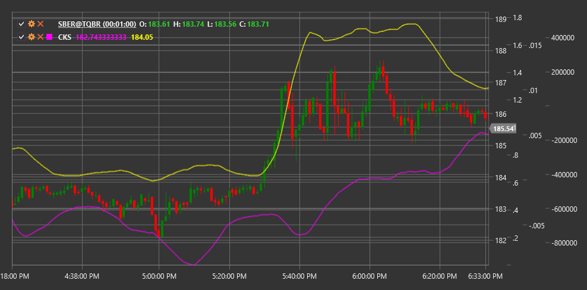

# CKS

**Chande Kroll Stop (CKS)** - это индикатор для определения уровней стоп-лосс, разработанный Тушаром Чанде и Стэнли Кроллом, который адаптируется к волатильности рынка и помогает трейдерам устанавливать точки выхода из позиций.

Для использования индикатора необходимо использовать класс [ChandeKrollStop](xref:StockSharp.Algo.Indicators.ChandeKrollStop).

## Описание

Индикатор Chande Kroll Stop был разработан как динамический инструмент для установки уровней стоп-лосс, который реагирует на изменения волатильности и тренда рынка. Он состоит из двух линий: верхней стоп-линии (для коротких позиций) и нижней стоп-линии (для длинных позиций).

Основное преимущество CKS заключается в его способности адаптироваться к текущим рыночным условиям. В периоды повышенной волатильности стоп-линии располагаются дальше от цены, позволяя избежать преждевременного закрытия позиций из-за рыночного шума. В периоды низкой волатильности стоп-линии приближаются к цене, обеспечивая более плотное следование за трендом.

CKS особенно полезен для:
- Определения уровней стоп-лосс для длинных и коротких позиций
- Следования за трендом с адаптивным контролем риска
- Выявления потенциальных точек разворота тренда
- Создания механических торговых систем с четкими правилами выхода

## Параметры

Индикатор имеет следующие параметры:
- **Period** - основной период для расчета экстремумов (стандартное значение: 10)
- **Multiplier** - множитель для ATR, определяющий расстояние от экстремумов (стандартное значение: 1.5)
- **StopPeriod** - период для расчета стоп-уровней (стандартное значение: 20)

## Расчет

Расчет Chande Kroll Stop включает следующие этапы:

1. Определение высоких и низких экстремумов за период Period:
   ```
   HighestHigh = Наибольшее значение High за период Period
   LowestLow = Наименьшее значение Low за период Period
   ```

2. Расчет среднего истинного диапазона (ATR) за период Period:
   ```
   ATR = Среднее значение TR за период Period
   ```

3. Расчет верхней и нижней полос:
   ```
   Верхняя полоса = HighestHigh - (Multiplier * ATR)
   Нижняя полоса = LowestLow + (Multiplier * ATR)
   ```

4. Определение окончательных стоп-линий на основе StopPeriod:
   ```
   Верхний стоп = Наибольшее значение верхней полосы за период StopPeriod
   Нижний стоп = Наименьшее значение нижней полосы за период StopPeriod
   ```

## Интерпретация

- **Верхний стоп (Upper Stop)** используется для коротких позиций. Если цена закрытия превышает верхний стоп, это может рассматриваться как сигнал к закрытию короткой позиции или открытию длинной.

- **Нижний стоп (Lower Stop)** используется для длинных позиций. Если цена закрытия опускается ниже нижнего стопа, это может рассматриваться как сигнал к закрытию длинной позиции или открытию короткой.

- **Пересечение ценой стоп-линий** может указывать на потенциальный разворот тренда или начало нового импульса.

- **Скачкообразное изменение стоп-линий** может происходить при значительных изменениях волатильности рынка.

- **Использование с другими индикаторами**: CKS лучше всего работает в сочетании с другими индикаторами тренда и импульса, которые помогают определить направление входа в рынок.



## См. также

[ATR](atr.md)
[ParabolicSAR](parabolic_sar.md)
[DonchianChannels](donchian_channels.md)