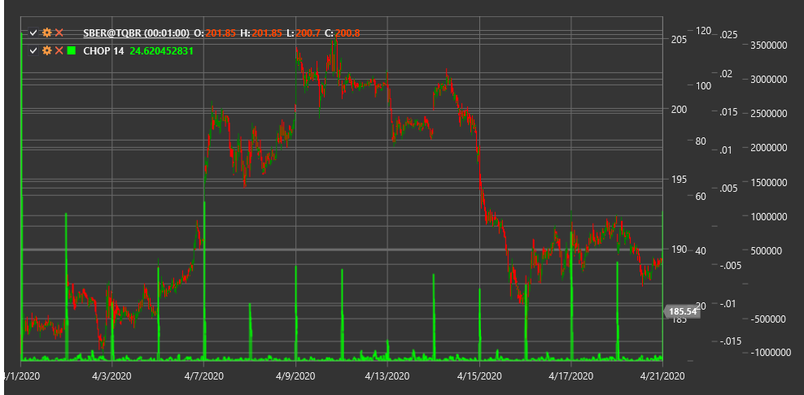

# CHOP

**Индекс размаха (Choppiness Index, CHOP)** - это индикатор, разработанный для определения, находится ли рынок в боковом движении (внутри диапазона) или в трендовом состоянии.

Для использования индикатора необходимо использовать класс [ChoppinessIndex](xref:StockSharp.Algo.Indicators.ChoppinessIndex).

## Описание

Индекс размаха (CHOP) был создан для количественной оценки волатильности и определения характера движения рынка. В отличие от многих других индикаторов, CHOP не предназначен для определения направления тренда или генерации сигналов на покупку или продажу. Вместо этого он помогает трейдерам определить, находится ли рынок в консолидации (боковое движение) или в направленном тренде.

Индикатор CHOP колеблется в диапазоне от 0 до 100:
- Значения ближе к 100 указывают на сильную консолидацию (высокую "размашистость")
- Значения ближе к 0 указывают на сильный направленный тренд (низкую "размашистость")

CHOP особенно полезен для:
- Определения подходящей торговой стратегии в зависимости от характера рынка
- Выявления переходов от бокового движения к тренду и наоборот
- Подтверждения или опровержения сигналов других индикаторов
- Избегания ложных сигналов во время консолидации

## Параметры

Индикатор имеет следующие параметры:
- **Length** - период расчета (стандартное значение: 14)

## Расчет

Расчет индекса размаха включает следующие этапы:

1. Расчет суммы истинных диапазонов (True Range) за выбранный период:
   ```
   Сумма TR = Сумма(TR(i)) для i от 1 до Length
   ```

2. Расчет наибольшего High и наименьшего Low за выбранный период:
   ```
   Наибольший High = максимальное значение High за период Length
   Наименьший Low = минимальное значение Low за период Length
   ```

3. Расчет сам индекс CHOP:
   ```
   CHOP = 100 * LOG10(Сумма TR / (Наибольший High - Наименьший Low)) / LOG10(Length)
   ```

где:
- TR - истинный диапазон для каждой свечи
- Length - выбранный период
- LOG10 - десятичный логарифм

## Интерпретация

- **Высокие значения CHOP (выше 60-70)** указывают на то, что рынок находится в боковом движении (консолидации). В этот период лучше избегать трендовых стратегий и рассмотреть стратегии торговли в диапазоне.

- **Низкие значения CHOP (ниже 30-40)** указывают на сильный направленный тренд. Это хорошее время для использования трендовых стратегий и следования за движением цены.

- **Переходы между высокими и низкими значениями** могут указывать на изменение характера рынка. Падение CHOP из области высоких значений может сигнализировать о начале нового тренда. Рост CHOP из области низких значений может предупреждать о затухании тренда и переходе к консолидации.

- **Установка пороговых уровней**: Обычно используются следующие пороговые уровни:
  - Выше 60-70: Высокая "размашистость" (боковое движение)
  - 30-60: Умеренная "размашистость" (переходное состояние)
  - Ниже 30: Низкая "размашистость" (сильный тренд)



## См. также

[ATR](atr.md)
[ADX](adx.md)
[VHF](vhf.md)
[TrueRange](true_range.md)