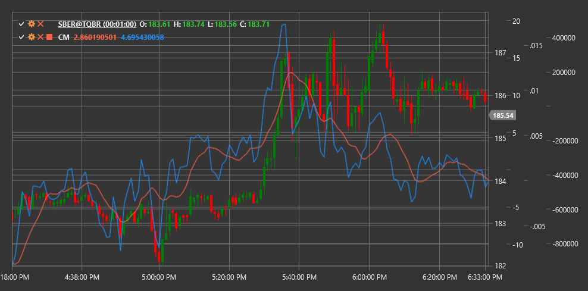

# CM

**Композитный моментум (Composite Momentum, CM)** - это индикатор, который объединяет несколько методов измерения импульса цены для получения более надежных сигналов о силе и направлении тренда.

Для использования индикатора необходимо использовать класс [CompositeMomentum](xref:StockSharp.Algo.Indicators.CompositeMomentum).

## Описание

Индикатор Композитный моментум (CM) представляет собой комплексный инструмент, который объединяет различные аспекты ценового движения, включая скорость изменения цены, относительную силу и другие компоненты импульса. Благодаря этому комбинированному подходу, CM дает более полную картину текущего импульса рынка по сравнению с традиционными одномерными индикаторами моментума.

CM эффективен для:
- Определения силы текущего тренда
- Выявления потенциальных точек разворота
- Обнаружения расхождений между ценой и импульсом
- Фильтрации ложных сигналов других индикаторов

Композитный моментум особенно полезен на волатильных рынках, где традиционные индикаторы моментума могут давать множество ложных сигналов.

## Расчет

Расчет Композитного моментума включает несколько этапов и компонентов:

1. Расчет компонентов моментума:
   - Изменение цены относительно предыдущих периодов
   - Соотношение между последними максимумами и минимумами
   - Анализ объема, сопровождающего движение цены

2. Нормализация каждого компонента для приведения к сопоставимым масштабам.

3. Взвешенное суммирование компонентов для получения итогового значения CM.

Окончательное значение CM представляет собой осциллятор, который может колебаться как в положительной, так и в отрицательной области:
- Положительные значения указывают на восходящий импульс
- Отрицательные значения указывают на нисходящий импульс
- Величина значения (абсолютное значение) указывает на силу импульса

## Интерпретация

- **Пересечение нулевой линии**:
  - Переход из отрицательной в положительную зону может рассматриваться как бычий сигнал
  - Переход из положительной в отрицательную зону может рассматриваться как медвежий сигнал

- **Экстремальные значения**:
  - Очень высокие положительные значения могут указывать на перекупленность рынка
  - Очень низкие отрицательные значения могут указывать на перепроданность рынка

- **Дивергенции**:
  - Бычья дивергенция: цена формирует новый минимум, а CM - более высокий минимум
  - Медвежья дивергенция: цена формирует новый максимум, а CM - более низкий максимум

- **Подтверждение тренда**:
  - Стабильно положительные значения CM подтверждают силу восходящего тренда
  - Стабильно отрицательные значения CM подтверждают силу нисходящего тренда

- **Потеря импульса**:
  - Снижение абсолютного значения CM в направлении тренда может сигнализировать о потере импульса и потенциальном развороте

## См. также

[Momentum](momentum.md)
[ROC](roc.md)
[RSI](rsi.md)
[MACD](macd.md)