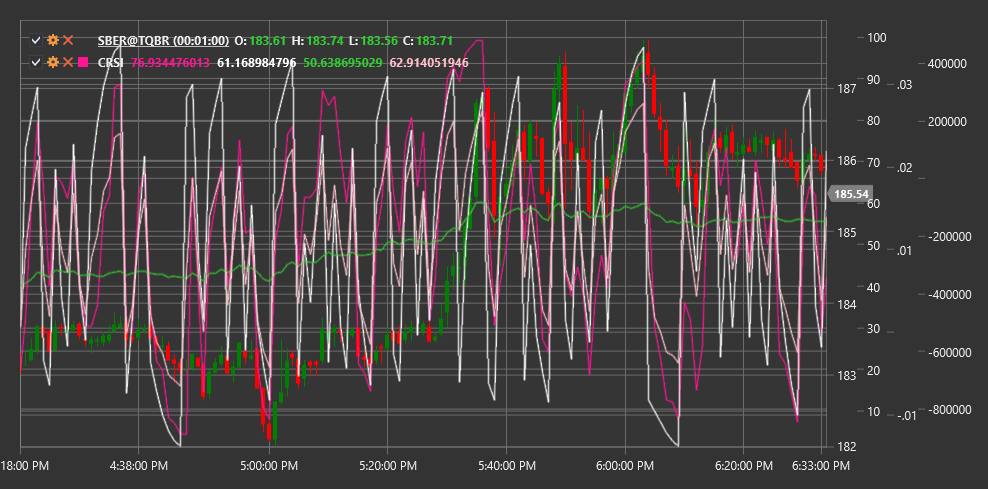

# CRSI

**Connors RSI (CRSI)** - это комплексный технический индикатор, разработанный Ларри Коннорсом, который объединяет три компонента для измерения перекупленности и перепроданности рынка.

Для использования индикатора необходимо использовать класс [ConnorsRSI](xref:StockSharp.Algo.Indicators.ConnorsRSI).

## Описание

Connors RSI представляет собой усовершенствованную версию традиционного индикатора относительной силы (RSI), которая добавляет два дополнительных компонента для обеспечения более точных сигналов перекупленности и перепроданности.

В отличие от стандартного RSI, который учитывает только изменение цены, Connors RSI также учитывает полосу (серию последовательных движений цены в одном направлении) и скорость изменения (ROC), что делает его более чувствительным к краткосрочным изменениям и более надежным в определении экстремальных условий рынка.

CRSI особенно полезен для:
- Выявления краткосрочных возможностей для входа и выхода
- Определения экстремальных уровней перекупленности и перепроданности
- Создания торговых систем на основе возврата к среднему (mean reversion)
- Фильтрации сигналов других индикаторов

## Параметры

Индикатор имеет следующие параметры:
- **RSIPeriod** - период для расчета компонента RSI (стандартное значение: 3)
- **StreakRSIPeriod** - период для расчета компонента RSI полосы (стандартное значение: 2)
- **ROCRSIPeriod** - период для расчета компонента RSI скорости изменения (стандартное значение: 100)

## Расчет

Расчет Connors RSI включает три компонента, которые затем усредняются для получения финального значения:

1. **Компонент RSI цены** - стандартный RSI, рассчитанный за короткий период (обычно 3 дня):
   ```
   RSI = 100 - (100 / (1 + RS))
   где RS = Среднее положительное изменение / Среднее отрицательное изменение
   ```

2. **Компонент RSI полосы (Streak RSI)**:
   - Сначала вычисляется полоса (количество последовательных дней роста или падения цены)
   - Затем к этой полосе применяется RSI с использованием периода StreakRSIPeriod

3. **Компонент RSI скорости изменения (ROC RSI)**:
   - Рассчитывается процентный ранг (Percentile Rank) текущего ROC за период ROCRSIPeriod
   - Процентный ранг масштабируется от 0 до 100

4. **Итоговое значение Connors RSI**:
   ```
   CRSI = (RSI + StreakRSI + ROCRSI) / 3
   ```

## Интерпретация

Connors RSI колеблется в диапазоне от 0 до 100, аналогично стандартному RSI:

- **Экстремально высокие значения (выше 90)** указывают на сильную перекупленность. Это может быть сигналом для продажи или короткой позиции.

- **Экстремально низкие значения (ниже 10)** указывают на сильную перепроданность. Это может быть сигналом для покупки или закрытия короткой позиции.

- **Стандартные уровни**:
  - Выше 70-80: перекупленность
  - Ниже 20-30: перепроданность
  - 40-60: нейтральная зона

- **Дивергенции**:
  - Бычья дивергенция: цена формирует новый минимум, а CRSI - более высокий минимум
  - Медвежья дивергенция: цена формирует новый максимум, а CRSI - более низкий максимум

Connors RSI лучше всего работает на графиках с таймфреймом от дневного до недельного и в торговых стратегиях, ориентированных на возврат к среднему (mean reversion).



## См. также

[RSI](rsi.md)
[StochasticRSI](stochastic_rsi.md)
[RMI](relative_momentum_index.md)
[LRSI](laguerre_rsi.md)