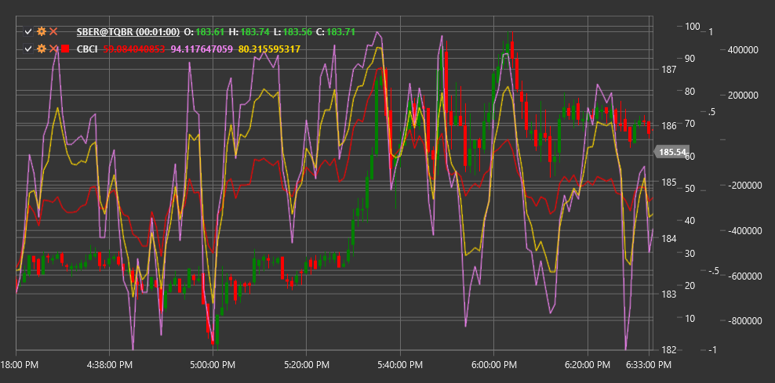

# CBCI

**Композитный индекс Констанс Браун (Constance Brown Composite Index, CBCI)** - это индикатор, разработанный Констанс Браун, который объединяет элементы различных технических индикаторов для создания комплексного инструмента анализа рынка.

Для использования индикатора необходимо использовать класс [ConstanceBrownCompositeIndex](xref:StockSharp.Algo.Indicators.ConstanceBrownCompositeIndex).

## Описание

Композитный индекс Констанс Браун (CBCI) был создан для объединения сильных сторон нескольких индикаторов в один комплексный инструмент. Он включает в себя элементы стохастического осциллятора, RSI и других осцилляторов, чтобы давать более точные сигналы о потенциальных разворотах рынка и трендовых движениях.

CBCI разработан для:
- Выявления потенциальных точек разворота тренда
- Определения уровней перекупленности и перепроданности
- Обнаружения скрытых дивергенций
- Подтверждения силы текущего тренда

Индикатор хорошо работает на различных таймфреймах и на различных типах рынков, включая акции, форекс и товарные рынки.

## Параметры

Индикатор имеет следующие параметры:
- **Length** - основной период расчета индекса (стандартное значение: 14)
- **StochasticKPeriod** - период для расчета %K стохастического осциллятора (стандартное значение: 5)
- **StochasticDPeriod** - период для расчета %D стохастического осциллятора (стандартное значение: 3)

## Расчет

Расчет CBCI включает следующие этапы:

1. Расчет RSI за период Length:
   ```
   RSI = 100 - (100 / (1 + RS))
   RS = Средний прирост / Средний спад
   ```

2. Расчет стохастического осциллятора:
   ```
   %K = ((Закрытие - Минимум за период) / (Максимум за период - Минимум за период)) * 100
   %D = SMA(%K, StochasticDPeriod)
   ```

3. Комбинирование RSI и стохастического осциллятора:
   ```
   CBCI = (RSI + %K + %D) / 3
   ```

Этот комбинированный индекс затем может быть сглажен для уменьшения шума.

## Интерпретация

- **Уровни перекупленности и перепроданности**: 
  - Значения выше 80 могут указывать на перекупленность рынка
  - Значения ниже 20 могут указывать на перепроданность рынка

- **Пересечение центральной линии**:
  - Пересечение снизу вверх линии 50 может рассматриваться как бычий сигнал
  - Пересечение сверху вниз линии 50 может рассматриваться как медвежий сигнал

- **Дивергенции**:
  - Классические дивергенции: когда цена и CBCI движутся в противоположных направлениях
  - Скрытые дивергенции: когда цена и CBCI создают разные типы максимумов или минимумов

- **Трендовое движение**:
  - Если CBCI последовательно остается выше 50, это может указывать на силу восходящего тренда
  - Если CBCI последовательно остается ниже 50, это может указывать на силу нисходящего тренда



## См. также

[RSI](rsi.md)
[StochasticOscillator](stochastic_oscillator.md)
[StochasticK](stochastic_oscillator_k%.md)
[CCI](cci.md)