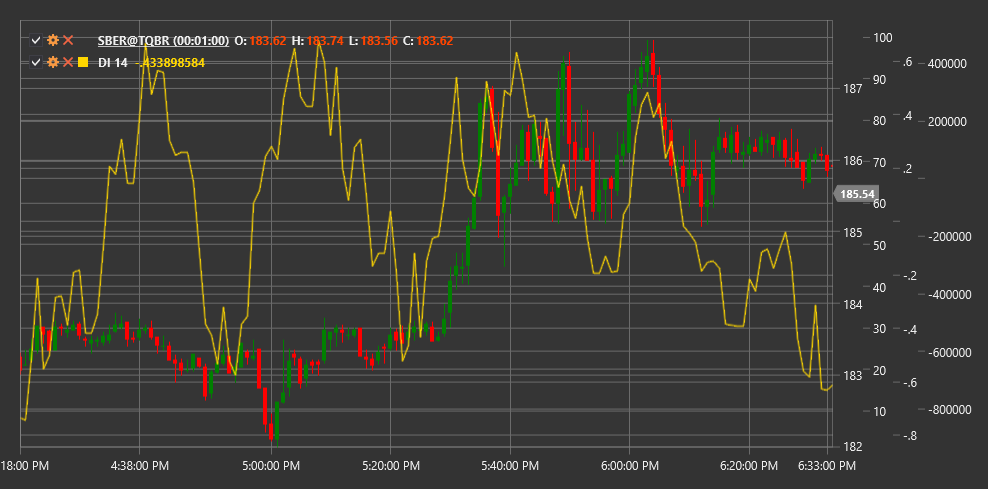

# DI

**Индекс спроса (Demand Index, DI)** - это технический индикатор, разработанный Джеймсом Сиббетом, который анализирует соотношение между ценой и объемом для оценки силы спроса и давления покупателей на рынке.

Для использования индикатора необходимо использовать класс [DemandIndex](xref:StockSharp.Algo.Indicators.DemandIndex).

## Описание

Индекс спроса (DI) - это комплексный объемный индикатор, который оценивает взаимосвязь между ценой и объемом, чтобы определить, насколько сильным является давление покупателей (спрос) по сравнению с давлением продавцов. Индикатор основан на предположении, что соотношение изменения цены к изменению объема позволяет более точно оценить рыночный спрос, чем просто наблюдение за ценой или объемом по отдельности.

DI стремится выявить следующие рыночные ситуации:
- Сильный спрос (давление покупателей)
- Слабый спрос (давление продавцов)
- Дисбаланс между ценой и объемом (потенциальные точки разворота)
- Подтверждение или опровержение текущего тренда

## Параметры

Индикатор имеет следующие параметры:
- **Length** - период расчета (стандартное значение: 13)

## Расчет

Расчет Индекса спроса довольно сложен и включает несколько этапов:

1. Расчет ценового компонента на основе изменения цены:
   ```
   Price Component = ((High + Low + Close) / 3) - ((Previous High + Previous Low + Previous Close) / 3)
   ```

2. Расчет объемного компонента, учитывающего относительное изменение объема.

3. Вычисление спроса как соотношения ценового и объемного компонентов:
   ```
   Raw Demand = Price Component / Volume Component
   ```

4. Сглаживание полученных значений для уменьшения шума:
   ```
   Smoothed Demand = EMA(Raw Demand, Length)
   ```

5. Нормализация результата для получения окончательного индекса:
   ```
   Demand Index = 100 * Normalized(Smoothed Demand)
   ```

## Интерпретация

Индекс спроса может интерпретироваться различными способами:

1. **Уровни экстремумов**:
   - Высокие положительные значения указывают на сильный спрос (давление покупателей)
   - Высокие отрицательные значения указывают на слабый спрос (давление продавцов)

2. **Пересечение нулевой линии**:
   - Переход снизу вверх может рассматриваться как бычий сигнал
   - Переход сверху вниз может рассматриваться как медвежий сигнал

3. **Дивергенции**:
   - Бычья дивергенция: цена образует новый минимум, но DI формирует более высокий минимум
   - Медвежья дивергенция: цена образует новый максимум, но DI формирует более низкий максимум

4. **Тренды в DI**:
   - Устойчивые положительные значения DI подтверждают восходящий тренд
   - Устойчивые отрицательные значения DI подтверждают нисходящий тренд

5. **Экстремальные значения**:
   - Очень высокие или очень низкие значения могут указывать на перекупленность или перепроданность рынка

Использование Индекса спроса наиболее эффективно в сочетании с другими индикаторами и методами анализа для фильтрации ложных сигналов.



## См. также

[OBV](on_balance_volume.md)
[ADL](accumulation_distribution_line.md)
[ChaikinMoneyFlow](chaikin_money_flow.md)
[BalanceOfPower](balance_of_power.md)