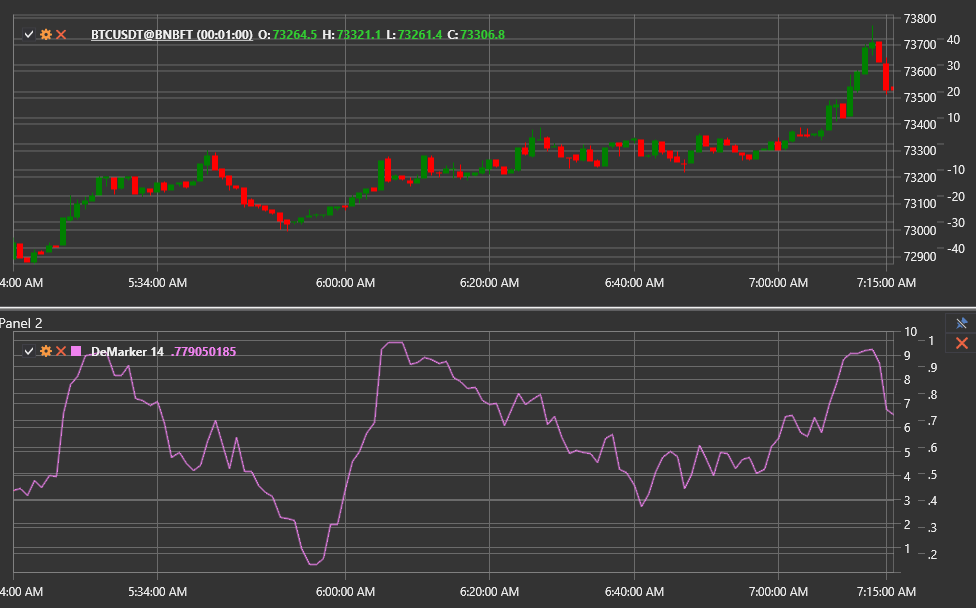

# DeMarker

**Индикатор DeMarker (DeM)** оценивает спрос на актив, сравнивая экстремумы текущего бара с предыдущим баром. Он показывает, 
перегружен ли рынок покупками или продажами, и помогает находить точки разворота.

Для использования индикатора необходимо применять класс [DeMarker](xref:StockSharp.Algo.Indicators.DeMarker).

## Расчёт

1. Для каждого бара определяются промежуточные величины:
   - `DeMax = max(High − PreviousHigh, 0)`
   - `DeMin = max(PreviousLow − Low, 0)`
2. Значения DeMax и DeMin сглаживаются скользящей средней с периодом **Length**.
3. Итоговое значение индикатора рассчитывается как отношение:  
   `DeMarker = SMA(DeMax, Length) / (SMA(DeMax, Length) + SMA(DeMin, Length))`.

Результат нормирован в диапазоне от 0 до 1.

## Параметры

- **Length** — период сглаживания, определяющий чувствительность индикатора.

## Интерпретация

- **Зона перекупленности**: значения выше 0.7 — сигнал о возможной коррекции вниз.
- **Зона перепроданности**: значения ниже 0.3 — сигнал о вероятном развороте вверх.
- **Дивергенции** между ценой и индикатором предупреждают о смене тренда.

Индикатор подходит как для поиска точек входа против тренда (на разворотах), так и для подтверждения текущего движения.

## См. также

[RSI](rsi.md)
[Stochastic Oscillator](stochastic_oscillator.md)
[Momentum](momentum.md)
