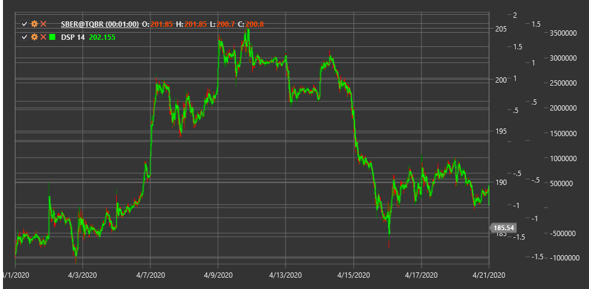

# DSP

**Синтетическая цена без тренда (Detrended Synthetic Price, DSP)** - это технический индикатор, который удаляет общий тренд из ценового ряда, позволяя трейдерам сосредоточиться на краткосрочных колебаниях цены.

Для использования индикатора необходимо использовать класс [DetrendedSyntheticPrice](xref:StockSharp.Algo.Indicators.DetrendedSyntheticPrice).

## Описание

Индикатор DSP был разработан для устранения долгосрочного тренда из ценового графика, что позволяет трейдерам более четко видеть краткосрочные циклы и колебания. Он особенно полезен для выявления краткосрочных торговых возможностей, которые могут быть скрыты доминирующим трендом.

Основная идея DSP заключается в том, что путем удаления тренда из ценового ряда можно лучше идентифицировать циклические компоненты движения цены. Это делает индикатор особенно ценным для трейдеров, которые специализируются на краткосрочной торговле и используют циклические модели.

DSP полезен для:
- Выявления краткосрочных циклов на рынке
- Определения потенциальных точек разворота
- Обнаружения дивергенций с ценой
- Создания торговых систем, основанных на циклической природе рынков

## Параметры

Индикатор имеет следующие параметры:
- **Length** - период расчета (стандартное значение: 10-20 периодов)

## Расчет

Расчет индикатора Detrended Synthetic Price включает следующие этапы:

1. Расчет скользящей средней цены за заданный период:
   ```
   MA = SMA(Price, Length)
   ```

2. Определение смещения для расчета синтетической цены:
   ```
   Offset = (Length / 2) + 1
   ```

3. Расчет синтетической цены путем вычитания смещенной скользящей средней из текущей цены:
   ```
   DSP = Price - MA[смещение на (Length/2) + 1 периодов назад]
   ```

где:
- Price - текущая цена (обычно цена закрытия)
- MA - простая скользящая средняя
- Length - выбранный период расчета

## Интерпретация

Индикатор DSP осциллирует вокруг нулевой линии и может интерпретироваться следующим образом:

1. **Пересечение нулевой линии**:
   - Когда DSP пересекает нулевую линию снизу вверх, это может рассматриваться как бычий сигнал
   - Когда DSP пересекает нулевую линию сверху вниз, это может рассматриваться как медвежий сигнал

2. **Экстремумы индикатора**:
   - Когда DSP достигает экстремально высоких значений, это может указывать на перекупленность рынка
   - Когда DSP достигает экстремально низких значений, это может указывать на перепроданность рынка

3. **Циклический анализ**:
   - Регулярные колебания DSP могут использоваться для определения периодичности рыночных циклов
   - Изменения в амплитуде колебаний могут указывать на изменения в рыночной динамике

4. **Дивергенции**:
   - Бычья дивергенция: цена образует новый минимум, а DSP - более высокий минимум
   - Медвежья дивергенция: цена образует новый максимум, а DSP - более низкий максимум

5. **Формирование паттернов**:
   - На графике DSP могут формироваться технические паттерны (голова и плечи, двойное дно и т.д.), которые могут предоставлять дополнительные торговые сигналы



## См. также

[DetrendedPriceOscillator](dpo.md)
[CenterOfGravityOscillator](center_of_gravity_oscillator.md)
[SineWave](sine_wave.md)
[CyclePeriod](cycle_period.md)