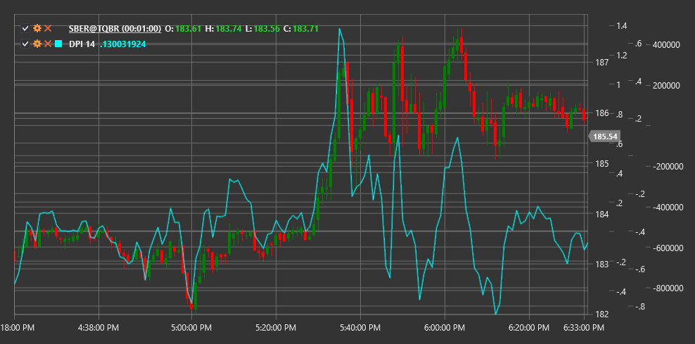

# DPI

**Индекс разницы (Disparity Index, DPI)** - это технический индикатор, который измеряет относительное отклонение текущей цены от скользящей средней за определенный период, выраженное в процентах.

Для использования индикатора необходимо использовать класс [DisparityIndex](xref:StockSharp.Algo.Indicators.DisparityIndex).

## Описание

Индекс разницы (DPI) предназначен для измерения степени отклонения цены от ее скользящей средней. Этот индикатор помогает определить, насколько цена "перетянута" относительно своего среднего значения, и может использоваться для выявления потенциальных состояний перекупленности или перепроданности.

DPI основан на предположении, что цена имеет тенденцию возвращаться к своей средней величине после значительного отклонения. Чем больше отклонение, тем выше вероятность последующего движения цены в противоположном направлении, возвращающего ее ближе к среднему значению.

Индекс разницы полезен для:
- Определения экстремальных отклонений цены от ее средней
- Выявления потенциальных точек разворота
- Измерения силы текущего тренда
- Создания торговых стратегий на основе возврата к среднему (mean reversion)

## Параметры

Индикатор имеет следующие параметры:
- **Length** - период для расчета скользящей средней (стандартное значение: 14)

## Расчет

Формула расчета индекса разницы довольно проста:

```
DPI = ((Price / MA) - 1) * 100
```

где:
- Price - текущая цена (обычно цена закрытия)
- MA - скользящая средняя цены за период Length
- Результат выражается в процентах

Положительные значения DPI указывают на то, что цена находится выше своей скользящей средней, а отрицательные - что цена находится ниже своей скользящей средней.

## Интерпретация

Индекс разницы может интерпретироваться следующим образом:

1. **Уровни экстремумов**:
   - Высокие положительные значения (например, выше +10%) могут указывать на перекупленность рынка
   - Высокие отрицательные значения (например, ниже -10%) могут указывать на перепроданность рынка

2. **Пересечение нулевой линии**:
   - Переход снизу вверх (от отрицательных к положительным значениям) указывает на то, что цена пересекла свою скользящую среднюю снизу вверх, что может рассматриваться как бычий сигнал
   - Переход сверху вниз (от положительных к отрицательным значениям) указывает на то, что цена пересекла свою скользящую среднюю сверху вниз, что может рассматриваться как медвежий сигнал

3. **Дивергенции**:
   - Бычья дивергенция: цена достигает нового минимума, но DPI формирует более высокий минимум
   - Медвежья дивергенция: цена достигает нового максимума, но DPI формирует более низкий максимум

4. **Анализ тренда**:
   - Устойчиво положительные значения DPI указывают на сильный восходящий тренд
   - Устойчиво отрицательные значения DPI указывают на сильный нисходящий тренд
   - Колебания около нуля могут указывать на боковой тренд или консолидацию

5. **Стратегии возврата к среднему**:
   - Экстремальные значения DPI могут использоваться для открытия позиций против текущего движения цены, ожидая возврата к среднему



## См. также

[SMA](sma.md)
[RSI](rsi.md)
[StochasticOscillator](stochastic_oscillator.md)
[BollingerBands](bollinger_bands.md)