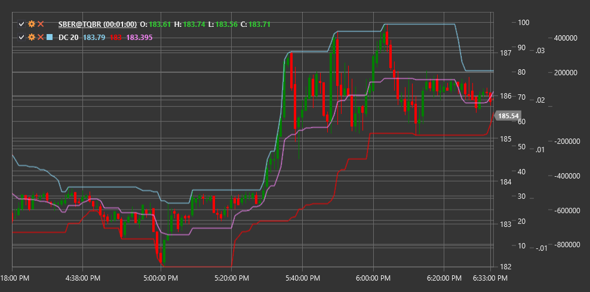

# DC

**Каналы Дончиана (Donchian Channels, DC)** - это технический индикатор, разработанный трейдером Ричардом Дончианом, который состоит из верхней и нижней полосы (границы канала), основанных на максимальных и минимальных значениях цены за определенный период.

Для использования индикатора необходимо использовать класс [DonchianChannels](xref:StockSharp.Algo.Indicators.DonchianChannels).

## Описание

Каналы Дончиана представляют собой простой, но эффективный индикатор волатильности и тренда. Индикатор состоит из трех линий:
- Верхняя линия: наивысший максимум за выбранный период
- Нижняя линия: наименьший минимум за выбранный период
- Средняя линия: среднее значение между верхней и нижней линиями

Этот индикатор был впервые использован Ричардом Дончианом в его правиле 4-недельного канала, согласно которому сигнал на покупку возникает, когда цена превышает наивысший максимум за 4 недели, а сигнал на продажу - когда цена опускается ниже наименьшего минимума за 4 недели.

Каналы Дончиана полезны для:
- Выявления волатильности рынка
- Определения уровней поддержки и сопротивления
- Генерации сигналов на прорыв (breakout)
- Определения текущего диапазона торговли

## Параметры

Индикатор имеет следующие параметры:
- **Length** - период расчета (стандартное значение: 20)

## Расчет

Расчет Каналов Дончиана довольно простой:

1. Верхняя линия канала:
   ```
   Upper = Наивысший High за период Length
   ```

2. Нижняя линия канала:
   ```
   Lower = Наименьший Low за период Length
   ```

3. Средняя линия канала:
   ```
   Middle = (Upper + Lower) / 2
   ```

## Интерпретация

Каналы Дончиана могут использоваться различными способами:

1. **Прорывные стратегии**:
   - Пробой верхней линии канала может рассматриваться как сигнал на покупку
   - Пробой нижней линии канала может рассматриваться как сигнал на продажу

2. **Определение тренда**:
   - Если цена находится в верхней половине канала (выше средней линии), можно говорить о восходящем тренде
   - Если цена находится в нижней половине канала (ниже средней линии), можно говорить о нисходящем тренде

3. **Уровни поддержки и сопротивления**:
   - Верхняя линия канала может служить уровнем сопротивления
   - Нижняя линия канала может служить уровнем поддержки

4. **Измерение волатильности**:
   - Ширина канала (разница между верхней и нижней линией) указывает на волатильность рынка
   - Расширение канала указывает на увеличение волатильности
   - Сужение канала указывает на уменьшение волатильности

5. **Контр-трендовые стратегии**:
   - Некоторые трейдеры используют противоположные сигналы, предполагая, что цена вернется к средней линии после достижения краев канала



## См. также

[BollingerBands](bollinger_bands.md)
[KeltnerChannels](keltner_channels.md)
[Highest](highest.md)
[Lowest](lowest.md)