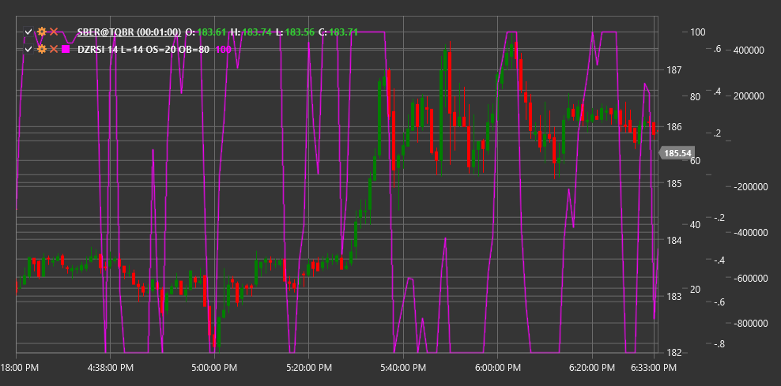

# DZRSI

**Индекс относительной силы в динамических зонах (Dynamic Zones RSI, DZRSI)** - это модификация классического индекса относительной силы (RSI), которая использует динамически изменяющиеся уровни перекупленности и перепроданности вместо статических.

Для использования индикатора необходимо использовать класс [DynamicZonesRSI](xref:StockSharp.Algo.Indicators.DynamicZonesRSI).

## Описание

Индекс относительной силы в динамических зонах (DZRSI) основан на традиционном RSI, но с важным улучшением: вместо использования фиксированных уровней перекупленности и перепроданности (обычно 70 и 30), DZRSI адаптирует эти уровни к текущим рыночным условиям.

Основная идея DZRSI заключается в том, что разные рыночные условия требуют разных порогов для определения перекупленности и перепроданности. В сильном восходящем тренде RSI может длительное время оставаться выше традиционного уровня перекупленности 70, не подавая точных сигналов для входа или выхода. Аналогично, в сильном нисходящем тренде RSI может долго оставаться ниже уровня перепроданности 30.

DZRSI решает эту проблему, динамически регулируя эти уровни на основе исторического поведения самого RSI, что делает индикатор более адаптивным к различным рыночным режимам.

## Параметры

Индикатор имеет следующие параметры:
- **Length** - период для расчета базового RSI (стандартное значение: 14)
- **OverboughtLevel** - начальный уровень перекупленности (стандартное значение: 70)
- **OversoldLevel** - начальный уровень перепроданности (стандартное значение: 30)

## Расчет

Расчет DZRSI включает несколько этапов:

1. Расчет стандартного RSI за указанный период Length:
   ```
   RSI = 100 - (100 / (1 + RS))
   RS = Среднее положительное изменение / Среднее отрицательное изменение
   ```

2. Определение диапазона колебаний RSI за определенный исторический период.

3. Адаптация уровней перекупленности и перепроданности на основе этого диапазона:
   ```
   Dynamic Overbought Level = Базовый уровень перекупленности + Корректировка на основе исторических данных
   Dynamic Oversold Level = Базовый уровень перепроданности - Корректировка на основе исторических данных
   ```

4. Корректировка динамических зон на основе силы текущего тренда.

## Интерпретация

DZRSI интерпретируется аналогично традиционному RSI, но с учетом динамических зон:

1. **Сигналы перекупленности и перепроданности**:
   - Когда DZRSI поднимается выше текущего динамического уровня перекупленности, это может указывать на перекупленность рынка
   - Когда DZRSI опускается ниже текущего динамического уровня перепроданности, это может указывать на перепроданность рынка

2. **Сигналы разворота**:
   - Разворот от динамического уровня перекупленности вниз может рассматриваться как сигнал продажи
   - Разворот от динамического уровня перепроданности вверх может рассматриваться как сигнал покупки

3. **Дивергенции**:
   - Бычья дивергенция: цена формирует новый минимум, а DZRSI - более высокий минимум
   - Медвежья дивергенция: цена формирует новый максимум, а DZRSI - более низкий максимум

4. **Анализ тренда**:
   - В восходящем тренде динамический уровень перепроданности может быть выше традиционных 30
   - В нисходящем тренде динамический уровень перекупленности может быть ниже традиционных 70

5. **Пересечение центральной линии (50)**:
   - Пересечение снизу вверх может рассматриваться как бычий сигнал
   - Пересечение сверху вниз может рассматриваться как медвежий сигнал



## См. также

[RSI](rsi.md)
[ConnorsRSI](connors_rsi.md)
[StochasticRSI](stochastic_rsi.md)
[LRSI](laguerre_rsi.md)