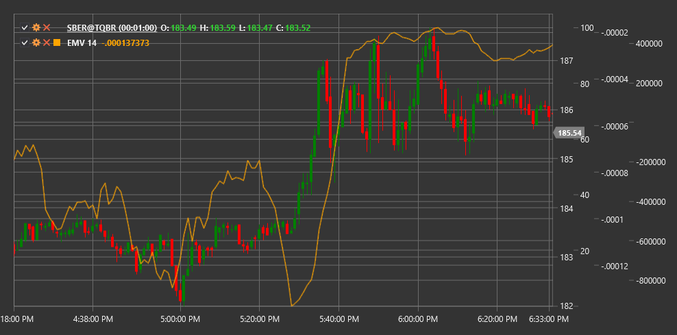

# EMV

**Легкость движения (Ease of Movement, EMV)** - это технический индикатор, разработанный Ричардом Армсом, который соотносит изменение цены с объемом, чтобы оценить легкость, с которой цена движется вверх или вниз.

Для использования индикатора необходимо использовать класс [EaseOfMovement](xref:StockSharp.Algo.Indicators.EaseOfMovement).

## Описание

Индикатор Легкость движения (EMV) был создан для измерения взаимосвязи между ценовым движением и объемом. Основная концепция индикатора заключается в том, что в восходящем тренде цена должна легко двигаться вверх при небольшом объеме, в то время как в нисходящем тренде цена должна легко двигаться вниз также при небольшом объеме.

EMV объединяет информацию о ценовом диапазоне, изменении цены и объеме, чтобы создать меру "легкости" движения цены. Положительные значения EMV указывают на то, что цена растет с относительной легкостью, в то время как отрицательные значения указывают на то, что цена падает с относительной легкостью.

Индикатор особенно полезен для:
- Подтверждения силы или слабости текущего тренда
- Выявления потенциальных точек разворота
- Обнаружения дивергенций с ценой
- Оценки "качества" ценового движения с учетом объема

## Параметры

Индикатор имеет следующие параметры:
- **Length** - период для сглаживания (стандартное значение: 14)

## Расчет

Расчет индикатора Легкость движения включает следующие этапы:

1. Расчет среднеточечного движения (Midpoint Move):
   ```
   Midpoint = (High + Low) / 2
   Midpoint Move = Midpoint[текущий] - Midpoint[предыдущий]
   ```

2. Расчет коэффициента объема-расстояния (Box Ratio):
   ```
   Box Ratio = Volume / (High - Low)
   ```

3. Расчет одноточечного EMV:
   ```
   1-Period EMV = Midpoint Move / Box Ratio
   ```

4. Сглаживание для получения окончательного EMV:
   ```
   EMV = SMA(1-Period EMV, Length)
   ```

где:
- High - максимальная цена свечи
- Low - минимальная цена свечи
- Volume - объем торгов
- SMA - простое скользящее среднее

## Интерпретация

Индикатор EMV может интерпретироваться следующим образом:

1. **Пересечение нулевой линии**:
   - Переход снизу вверх (от отрицательных значений к положительным) может рассматриваться как бычий сигнал, указывающий на то, что цена начинает двигаться вверх с легкостью
   - Переход сверху вниз (от положительных значений к отрицательным) может рассматриваться как медвежий сигнал, указывающий на то, что цена начинает двигаться вниз с легкостью

2. **Экстремальные значения**:
   - Высокие положительные значения указывают на то, что цена движется вверх очень легко (с небольшим объемом)
   - Высокие отрицательные значения указывают на то, что цена движется вниз очень легко (с небольшим объемом)

3. **Дивергенции**:
   - Бычья дивергенция: цена формирует новый минимум, а EMV - более высокий минимум (может указывать на потенциальный разворот вверх)
   - Медвежья дивергенция: цена формирует новый максимум, а EMV - более низкий максимум (может указывать на потенциальный разворот вниз)

4. **Тренды в EMV**:
   - Устойчивые положительные значения подтверждают восходящий тренд
   - Устойчивые отрицательные значения подтверждают нисходящий тренд
   - Колебания вокруг нуля могут указывать на боковой тренд или консолидацию

5. **Объемный анализ**:
   - Если цена растет при положительном EMV, это подтверждает силу восходящего движения
   - Если цена падает при отрицательном EMV, это подтверждает силу нисходящего движения
   - Если цена растет при отрицательном EMV или падает при положительном EMV, это может указывать на неустойчивость текущего движения



## См. также

[ForceIndex](force_index.md)
[BalanceOfPower](balance_of_power.md)
[ADL](accumulation_distribution_line.md)
[OBV](obv.md)