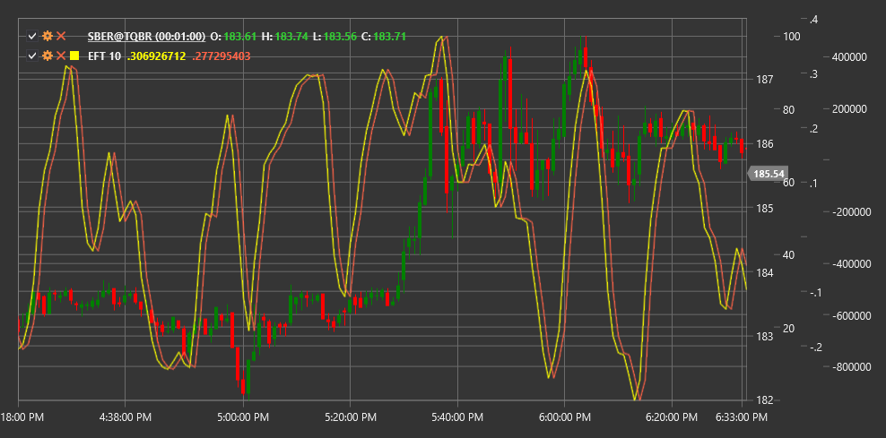

# EFT

**Преобразование Элерса-Фишера (Ehlers Fisher Transform, EFT)** - это технический индикатор, разработанный Джоном Элерсом, который использует статистическое преобразование Фишера для превращения ценовых данных в нормально распределенную форму.

Для использования индикатора необходимо использовать класс [EhlersFisherTransform](xref:StockSharp.Algo.Indicators.EhlersFisherTransform).

## Описание

Преобразование Элерса-Фишера основано на концепции, что рыночные цены не имеют нормального (гауссова) распределения. Вместо этого, они часто демонстрируют асимметричные распределения. Индикатор применяет математическую формулу преобразования Фишера для преобразования этих несимметричных распределений в нормально распределенные значения.

Это преобразование делает экстремальные движения цены более заметными и помогает более четко идентифицировать точки разворота на рынке. Когда применяется преобразование Фишера, пиковые значения резко возрастают, делая крайности рыночного поведения более очевидными.

EFT особенно полезен для:
- Определения потенциальных точек разворота рынка
- Выявления перекупленных и перепроданных условий
- Обнаружения скрытых дивергенций между ценой и индикатором
- Генерации более точных сигналов для входа и выхода с рынка

## Параметры

Индикатор имеет следующие параметры:
- **Length** - период для расчета (стандартное значение: 10)

## Расчет

Расчет Преобразования Элерса-Фишера включает несколько этапов:

1. Преобразование ценовых данных в значения между -1 и +1 (обычно используя нормализованный ранг цены или другой осциллятор):
   ```
   Value = (2 * ((Price - Min) / (Max - Min))) - 1
   ```
   где Min и Max - минимальная и максимальная цены за период Length.

2. Применение преобразования Фишера:
   ```
   Если Value >= 0.999, то Value = 0.999
   Если Value <= -0.999, то Value = -0.999
   
   Fisher = 0.5 * ln((1 + Value) / (1 - Value))
   ```
   где ln - натуральный логарифм.

3. Сглаживание для уменьшения шума:
   ```
   EFT = EMA(Fisher, Period)
   ```
   где EMA - экспоненциальное скользящее среднее.

## Интерпретация

Преобразование Элерса-Фишера можно интерпретировать следующим образом:

1. **Экстремальные значения**:
   - Значения выше +2 часто указывают на перекупленность рынка
   - Значения ниже -2 часто указывают на перепроданность рынка

2. **Пересечение нулевой линии**:
   - Пересечение нулевой линии снизу вверх может рассматриваться как бычий сигнал
   - Пересечение нулевой линии сверху вниз может рассматриваться как медвежий сигнал

3. **Разворот индикатора**:
   - Разворот индикатора от экстремальных значений часто предшествует развороту цены

4. **Дивергенции**:
   - Бычья дивергенция: цена формирует новый минимум, а EFT формирует более высокий минимум
   - Медвежья дивергенция: цена формирует новый максимум, а EFT формирует более низкий максимум

5. **Наклон линии индикатора**:
   - Крутой наклон вверх указывает на сильный восходящий импульс
   - Крутой наклон вниз указывает на сильный нисходящий импульс

Преобразование Элерса-Фишера отличается от многих других осцилляторов тем, что оно может достигать экстремальных значений и оставаться там некоторое время, не обязательно сразу разворачиваясь. Это делает его полезным для определения сильных трендовых движений.



## См. также

[CenterOfGravityOscillator](center_of_gravity_oscillator.md)
[SineWave](sine_wave.md)
[HarmonicOscillator](harmonic_oscillator.md)
[RSI](rsi.md)