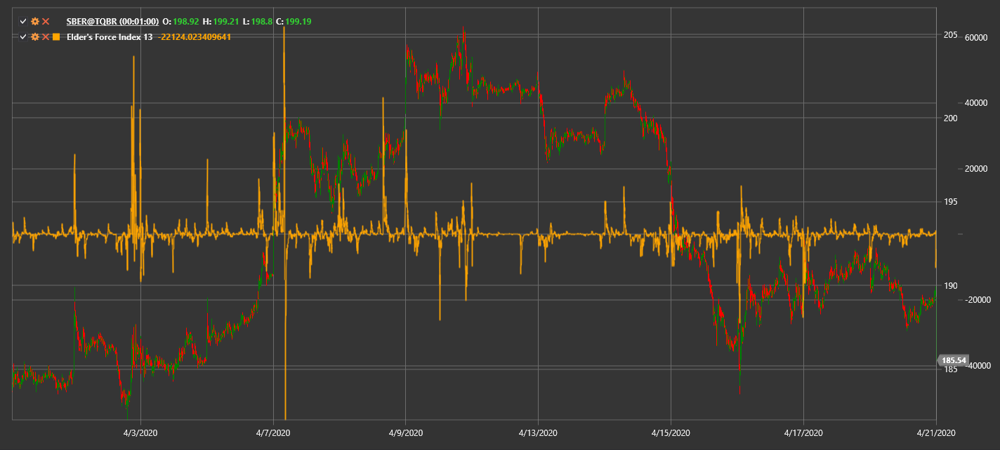

# Elder's Force Index

**Индекс силы Элдера (Elder's Force Index, EFI)** измеряет давление покупателей и продавцов через изменение цены и объём.

Для использования индикатора необходимо использовать класс [ElderForceIndex](xref:StockSharp.Algo.Indicators.ElderForceIndex).

## См. также

[Force Index](force_index.md)
