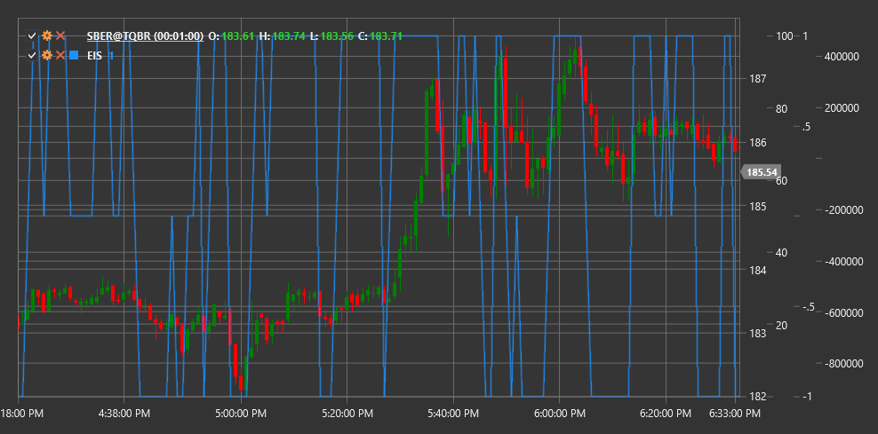

# EIS

**Система старшего импульса (Elder Impulse System, EIS)** - это технический индикатор, разработанный доктором Александром Элдером, который комбинирует трендовый индикатор и импульсный осциллятор для определения направления и силы рыночного движения.

Для использования индикатора необходимо использовать класс [ElderImpulseSystem](xref:StockSharp.Algo.Indicators.ElderImpulseSystem).

## Описание

Система старшего импульса (EIS) представляет собой простой, но мощный инструмент для визуализации рыночного импульса. Она объединяет два индикатора:
1. **Экспоненциальное скользящее среднее (EMA)** - для определения направления тренда
2. **Гистограмма MACD** - для измерения силы и импульса движения цены

EIS классифицирует каждую свечу на ценовом графике как принадлежащую к одной из трех категорий (обычно обозначаемых разными цветами):
- **Зеленая (сильный бычий импульс)** - когда оба индикатора растут
- **Красная (сильный медвежий импульс)** - когда оба индикатора падают
- **Синяя или нейтральная (отсутствие четкого импульса)** - когда индикаторы движутся в противоположных направлениях

EIS особенно полезна для:
- Быстрого визуального определения направления и силы тренда
- Выявления точек входа и выхода в направлении основного тренда
- Идентификации потенциальных точек разворота
- Фильтрации ложных сигналов

## Расчет

Расчет Системы старшего импульса включает следующие этапы:

1. Расчет 13-периодного экспоненциального скользящего среднего (EMA):
   ```
   EMA = EMA(Close, 13)
   ```

2. Расчет гистограммы MACD (стандартные значения: 12, 26, 9):
   ```
   MACD Line = EMA(Close, 12) - EMA(Close, 26)
   Signal Line = EMA(MACD Line, 9)
   MACD Histogram = MACD Line - Signal Line
   ```

3. Определение цветовой классификации для текущей свечи:
   ```
   Если EMA[текущий] > EMA[предыдущий] И MACD Histogram[текущий] > MACD Histogram[предыдущий], то Зеленый (Бычий импульс)
   Если EMA[текущий] < EMA[предыдущий] И MACD Histogram[текущий] < MACD Histogram[предыдущий], то Красный (Медвежий импульс)
   В противном случае Синий (Отсутствие импульса)
   ```

## Интерпретация

Система старшего импульса интерпретируется следующим образом:

1. **Зеленые свечи (сильный бычий импульс)**:
   - Указывают на сильный восходящий импульс
   - Лучшее время для покупки или удержания длинных позиций
   - Серия зеленых свечей указывает на сильный восходящий тренд

2. **Красные свечи (сильный медвежий импульс)**:
   - Указывают на сильный нисходящий импульс
   - Лучшее время для продажи или удержания коротких позиций
   - Серия красных свечей указывает на сильный нисходящий тренд

3. **Синие свечи (отсутствие четкого импульса)**:
   - Указывают на неопределенность или консолидацию
   - Сигнализируют о возможном замедлении или развороте текущего тренда
   - Часто появляются в периоды консолидации или перед сменой тренда

4. **Торговые стратегии**:
   - Покупать, когда свечи меняют цвет с синего на зеленый
   - Продавать, когда свечи меняют цвет с синего на красный
   - Закрывать длинные позиции, когда свечи меняют цвет с зеленого на любой другой
   - Закрывать короткие позиции, когда свечи меняют цвет с красного на любой другой

5. **Подтверждение тренда**:
   - Последовательность зеленых свечей подтверждает восходящий тренд
   - Последовательность красных свечей подтверждает нисходящий тренд
   - Чередование цветов указывает на боковой тренд или неопределенность



## См. также

[EMA](ema.md)
[MACD](macd.md)
[MACDHistogram](macd_histogram.md)
[ForceIndex](force_index.md)