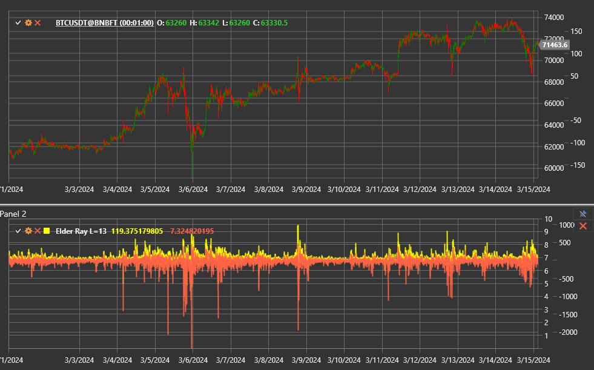

# Elder Ray

**Elder Ray Index** — комплексный индикатор Александра Элдера, который сочетает экспоненциальную скользящую среднюю с осцилляторами
Bull Power и Bear Power. Он помогает оценить баланс сил между покупателями и продавцами и обнаружить моменты, когда одна из
сторон теряет инициативу.

Для использования индикатора необходимо применять класс [ElderRay](xref:StockSharp.Algo.Indicators.ElderRay).

## Состав

Индикатор возвращает составное значение [ElderRayValue](xref:StockSharp.Algo.Indicators.ElderRayValue), включающее:

- **EMA** — базовую экспоненциальную скользящую среднюю цены закрытия;
- **Bull Power** — расстояние между максимумом свечи и EMA;
- **Bear Power** — расстояние между минимумом свечи и EMA.

## Параметры

Elder Ray наследует настройки [ExponentialMovingAverage](xref:StockSharp.Algo.Indicators.ExponentialMovingAverage):

- **Length** — период EMA;
- **Alpha** — коэффициент сглаживания (если используется напрямую).

## Интерпретация

- **Bull Power > 0** и растущая EMA — подтверждение восходящего тренда.
- **Bear Power < 0** и падающая EMA — подтверждение нисходящего тренда.
- Сокращение Bull Power при росте цены либо рост Bear Power при падении цены формируют дивергенции и предупреждают о развороте.
- Пересечение Bull Power и Bear Power уровней 0 трактуется как смена доминирующей стороны.

Торговые решения принимают, анализируя одновременно значение EMA и оба осциллятора. Например, сигнал на покупку возникает, когда
EMA растёт, Bear Power повышается после нового минимума, а Bull Power выходит выше нуля.

## См. также

[Bull Power](bull_power.md)
[Bear Power](bear_power.md)
[ExponentialMovingAverage](ema.md)
