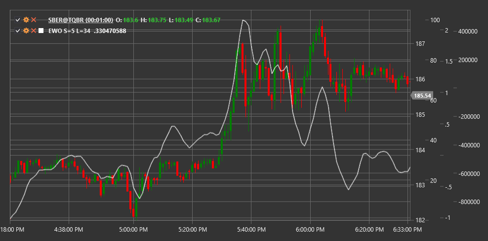

# EWO

**Осциллятор волн Эллиота (Elliot Wave Oscillator, EWO)** - это технический индикатор, основанный на теории волн Эллиота, который помогает трейдерам определять структуру волн и потенциальные точки разворота на рынке.

Для использования индикатора необходимо использовать класс [ElliotWaveOscillator](xref:StockSharp.Algo.Indicators.ElliotWaveOscillator).

## Описание

Осциллятор волн Эллиота (EWO) был разработан для того, чтобы помочь трейдерам в применении теории волн Эллиота при анализе рынка. Теория волн Эллиота предполагает, что рынки движутся в предсказуемых циклах, состоящих из пяти волн в направлении тренда (импульсные волны) и трех волн против тренда (коррективные волны).

EWO основан на разнице между быстрой и медленной скользящими средними и предназначен для выявления импульсных и коррективных волн в соответствии с теорией Эллиота. Он помогает определить, когда рынок находится в импульсной или коррективной фазе, и подсказывает потенциальные точки разворота.

Осциллятор волн Эллиота особенно полезен для:
- Идентификации текущей волновой структуры по Эллиоту
- Определения потенциального окончания импульсных и коррективных волн
- Подтверждения ручного волнового анализа
- Прогнозирования потенциальных точек разворота

## Параметры

Индикатор имеет следующие параметры:
- **ShortPeriod** - период для короткой скользящей средней (стандартное значение: 5)
- **LongPeriod** - период для длинной скользящей средней (стандартное значение: 35)

## Расчет

Расчет Осциллятора волн Эллиота достаточно прост:

```
EWO = EMA(Close, ShortPeriod) - EMA(Close, LongPeriod)
```

где:
- EMA - экспоненциальное скользящее среднее
- Close - цена закрытия
- ShortPeriod - короткий период (обычно 5)
- LongPeriod - длинный период (обычно 35)

## Интерпретация

Осциллятор волн Эллиота можно интерпретировать следующим образом:

1. **Положительные и отрицательные значения**:
   - Положительные значения (EWO выше нуля) указывают на то, что короткая EMA находится выше длинной EMA, что часто соответствует бычьему тренду или импульсной волне вверх
   - Отрицательные значения (EWO ниже нуля) указывают на то, что короткая EMA находится ниже длинной EMA, что часто соответствует медвежьему тренду или импульсной волне вниз

2. **Пересечение нулевой линии**:
   - Пересечение нулевой линии снизу вверх может сигнализировать о начале новой импульсной волны вверх
   - Пересечение нулевой линии сверху вниз может сигнализировать о начале новой импульсной волны вниз

3. **Экстремумы осциллятора**:
   - Пики и впадины осциллятора могут соответствовать окончанию импульсных волн
   - После достижения экстремума часто следует коррективная фаза

4. **Дивергенции**:
   - Бычья дивергенция (цена формирует новый минимум, а EWO - более высокий минимум) может указывать на потенциальное окончание нисходящей импульсной волны
   - Медвежья дивергенция (цена формирует новый максимум, а EWO - более низкий максимум) может указывать на потенциальное окончание восходящей импульсной волны

5. **Волновая структура**:
   - В импульсных волнах (волны 1, 3, 5) EWO обычно показывает сильные значения в направлении тренда
   - В коррективных волнах (волны 2, 4, A, B, C) EWO обычно показывает более слабые значения или движется в направлении, противоположном основному тренду

6. **Идентификация волны 3**:
   - Волна 3, которая обычно является самой сильной импульсной волной по теории Эллиота, часто характеризуется наивысшими значениями EWO



## См. также

[EMA](ema.md)
[MACD](macd.md)
[ZigZag](zigzag.md)
[WaveTrendOscillator](wave_trend_oscillator.md)