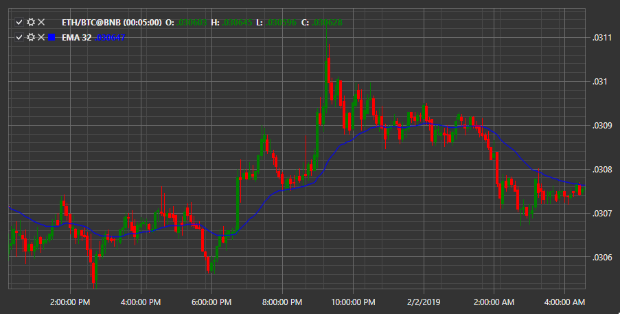

# EMA

**Экспоненциальное скользящее среднее (EMA)** \- это тип скользящего среднего (MA), который придает больший вес и значимость самым последним данным.

Для использования индикатора необходимо использовать класс [ExponentialMovingAverage](xref:StockSharp.Algo.Indicators.ExponentialMovingAverage). 

## См. также

[Фракталы](fractals.md)
