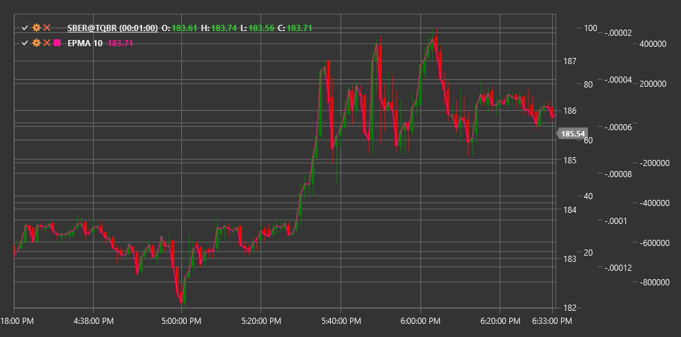

# EPMA

**Конечная скользящая средняя (Endpoint Moving Average, EPMA)** - это технический индикатор, который представляет собой модификацию стандартной скользящей средней, разработанную для уменьшения задержки при определении трендов.

Для использования индикатора необходимо использовать класс [EndpointMovingAverage](xref:StockSharp.Algo.Indicators.EndpointMovingAverage).

## Описание

Конечная скользящая средняя (EPMA) - это специальная форма скользящей средней, которая фокусируется на конечных точках интервала данных. В отличие от стандартных скользящих средних, которые равномерно взвешивают все точки в заданном периоде, EPMA придает больший вес конечным точкам периода, что позволяет быстрее реагировать на изменения тренда.

Основная цель EPMA - уменьшить задержку, присущую традиционным скользящим средним, сохраняя при этом способность фильтровать рыночный шум. Благодаря своей методологии расчета, EPMA часто быстрее реагирует на изменения направления цены, что делает ее ценным инструментом для трейдеров, которые стремятся раньше определить развороты тренда.

EPMA особенно полезна для:
- Более раннего определения изменений тренда
- Уменьшения задержки сигналов
- Создания более чувствительных торговых систем
- Подтверждения сигналов других индикаторов с меньшей задержкой

## Параметры

Индикатор имеет следующие параметры:
- **Length** - период расчета (стандартное значение: 14)

## Расчет

Расчет Конечной скользящей средней основан на методе линейной регрессии, который фокусируется на конечных точках рассматриваемого периода:

1. Определение линейного тренда между начальной и конечной точками периода:
   ```
   Start Value = Price[текущий - Length + 1]
   End Value = Price[текущий]
   ```

2. Расчет угла наклона (slope) линии тренда:
   ```
   Slope = (End Value - Start Value) / (Length - 1)
   ```

3. Вычисление EPMA как проекции линии тренда на текущую точку:
   ```
   EPMA = Start Value + Slope * (Length - 1)
   ```

Фактически, EPMA равен последнему значению цены (End Value) в рассматриваемом периоде, но концептуально это проекция линейного тренда, определенного конечными точками.

## Интерпретация

Конечная скользящая средняя интерпретируется аналогично другим скользящим средним, но с учетом ее повышенной чувствительности:

1. **Направление EPMA**:
   - Восходящая EPMA указывает на восходящий тренд
   - Нисходящая EPMA указывает на нисходящий тренд

2. **Пересечения с ценой**:
   - Когда цена пересекает EPMA снизу вверх, это может рассматриваться как бычий сигнал
   - Когда цена пересекает EPMA сверху вниз, это может рассматриваться как медвежий сигнал

3. **Пересечения нескольких EPMA**:
   - Пересечение короткой EPMA с длинной EPMA снизу вверх может указывать на начало восходящего тренда
   - Пересечение короткой EPMA с длинной EPMA сверху вниз может указывать на начало нисходящего тренда

4. **Расхождение с другими скользящими средними**:
   - Из-за своей повышенной чувствительности, EPMA может раньше реагировать на изменения тренда, чем традиционные скользящие средние
   - Расхождение между EPMA и другими типами скользящих средних может служить ранним предупреждением о потенциальном изменении тренда

5. **Фильтрация сигналов**:
   - Из-за своей повышенной чувствительности, EPMA может генерировать больше ложных сигналов в периоды боковой консолидации
   - Рекомендуется использовать дополнительные фильтры или подтверждения от других индикаторов для повышения надежности сигналов



## См. также

[SMA](sma.md)
[EMA](ema.md)
[ZLEMA](zero_lag_exponential_moving_average.md)
[DEMA](dema.md)