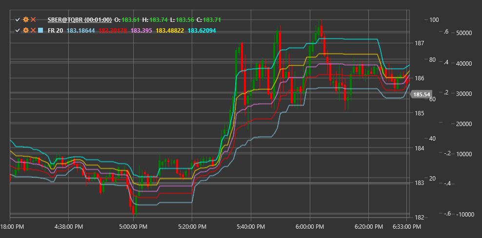

# FR

**Фибоначчи коррекция (Fibonacci Retracement, FR)** - это технический индикатор, основанный на числах Фибоначчи, который помогает определить потенциальные уровни поддержки и сопротивления на основе предыдущего ценового движения.

Для использования индикатора необходимо использовать класс [FibonacciRetracement](xref:StockSharp.Algo.Indicators.FibonacciRetracement).

## Описание

Фибоначчи коррекция - это популярный технический инструмент, который использует горизонтальные линии для обозначения областей возможной поддержки или сопротивления на графике цены. Эти уровни основаны на числах Фибоначчи и соответствующих им процентных соотношениях.

Индикатор основан на математической последовательности Фибоначчи, где каждое число является суммой двух предыдущих (1, 1, 2, 3, 5, 8, 13, 21, 34...). Из этой последовательности выводятся ключевые соотношения, используемые в техническом анализе: 23.6%, 38.2%, 50%, 61.8% и 78.6%.

Фибоначчи коррекция применяется к значительному ценовому движению (тренду) и показывает, на каких уровнях может произойти коррекция (откат) перед продолжением движения в направлении основного тренда.

Индикатор особенно полезен для:
- Определения потенциальных уровней поддержки в восходящем тренде
- Определения потенциальных уровней сопротивления в нисходящем тренде
- Установки целей для входа в рынок после коррекции
- Определения уровней для размещения стоп-лоссов

## Параметры

Индикатор имеет следующие параметры:
- **Length** - период для определения значимого ценового движения (стандартное значение зависит от таймфрейма)

## Расчет

Расчет уровней Фибоначчи коррекции включает следующие этапы:

1. Определение значимого ценового движения (тренда):
   - В восходящем тренде: от минимума до максимума
   - В нисходящем тренде: от максимума до минимума

2. Расчет уровней коррекции на основе диапазона этого движения:
   ```
   Диапазон = |Максимум - Минимум|
   
   Уровень 0% = Максимум (для восходящего тренда) или Минимум (для нисходящего тренда)
   Уровень 23.6% = Максимум - (Диапазон * 0.236) или Минимум + (Диапазон * 0.236)
   Уровень 38.2% = Максимум - (Диапазон * 0.382) или Минимум + (Диапазон * 0.382)
   Уровень 50.0% = Максимум - (Диапазон * 0.5) или Минимум + (Диапазон * 0.5)
   Уровень 61.8% = Максимум - (Диапазон * 0.618) или Минимум + (Диапазон * 0.618)
   Уровень 78.6% = Максимум - (Диапазон * 0.786) или Минимум + (Диапазон * 0.786)
   Уровень 100% = Минимум (для восходящего тренда) или Максимум (для нисходящего тренда)
   ```

## Интерпретация

Уровни Фибоначчи коррекции интерпретируются следующим образом:

1. **Основные уровни коррекции**:
   - 23.6% - слабый уровень, часто пробивается при сильном тренде
   - 38.2% - умеренный уровень, соответствует типичной коррекции
   - 50.0% - психологически значимый уровень (хотя не является числом Фибоначчи)
   - 61.8% - "золотое сечение", наиболее важный уровень Фибоначчи
   - 78.6% - глубокая коррекция, может сигнализировать о возможном развороте тренда

2. **В восходящем тренде**:
   - Уровни Фибоначчи служат потенциальными уровнями поддержки
   - Отскок от уровня Фибоначчи может быть сигналом для входа в длинную позицию
   - Пробой нескольких уровней Фибоначчи вниз может указывать на ослабление тренда

3. **В нисходящем тренде**:
   - Уровни Фибоначчи служат потенциальными уровнями сопротивления
   - Отскок от уровня Фибоначчи может быть сигналом для входа в короткую позицию
   - Пробой нескольких уровней Фибоначчи вверх может указывать на ослабление тренда

4. **Совпадение с другими уровнями**:
   - Уровни Фибоначчи имеют большее значение, если они совпадают с другими важными уровнями (предыдущие максимумы/минимумы, скользящие средние и т.д.)

5. **Построение на разных таймфреймах**:
   - Уровни Фибоначчи, построенные на разных таймфреймах, могут создавать зоны кластеризации, где вероятность разворота повышается



## См. также

[FibonacciExtensions](fibonacci_extensions.md)
[FibonacciFan](fibonacci_fan.md)
[FibonacciTimeZones](fibonacci_time_zones.md)
[PivotPoints](pivot_points.md)